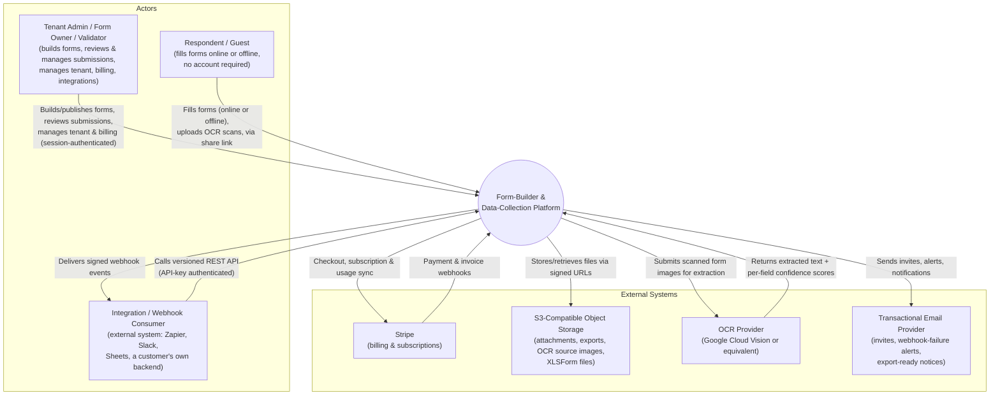
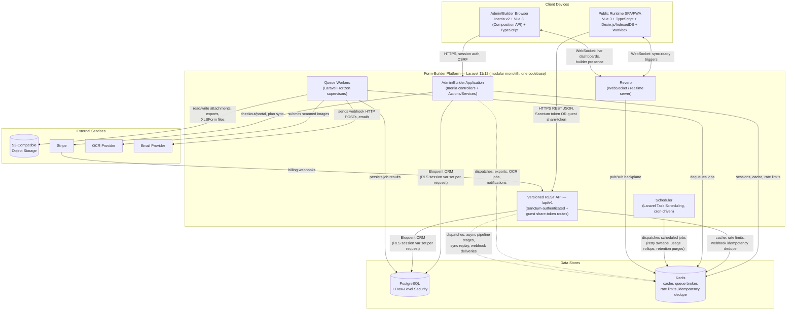
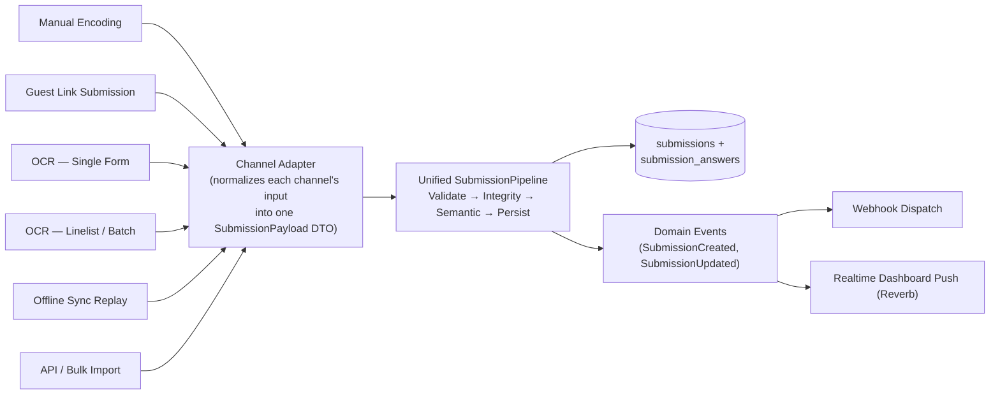
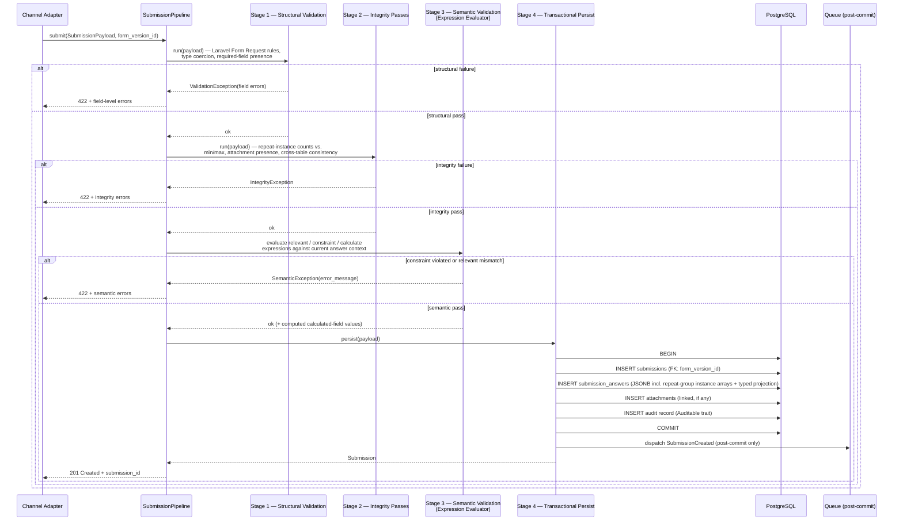
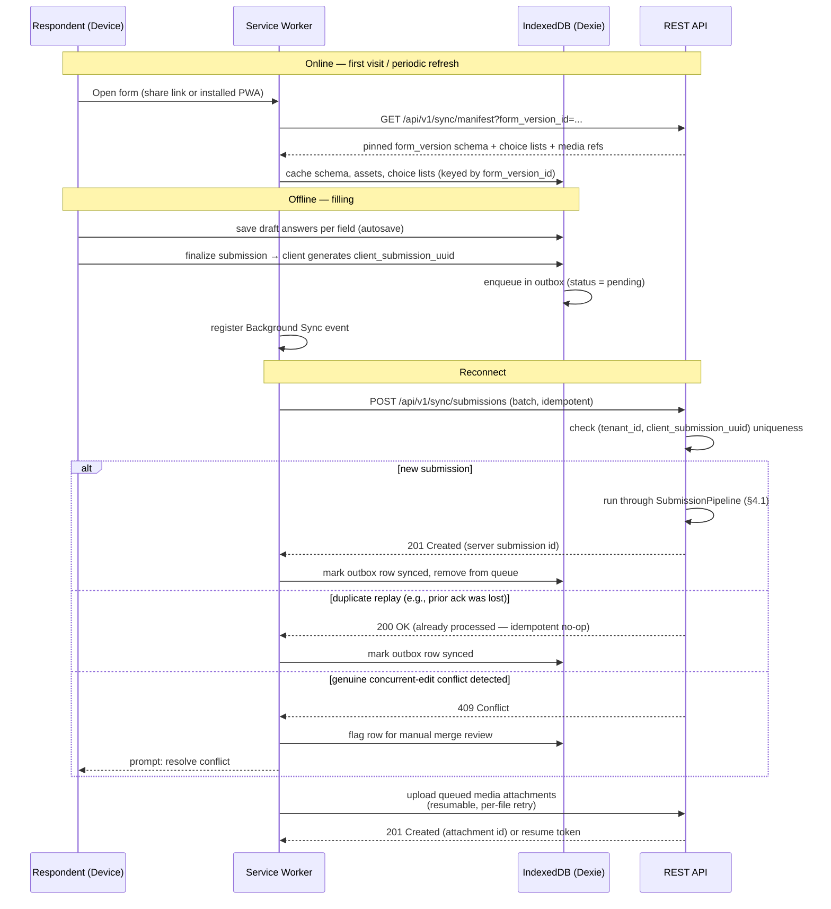
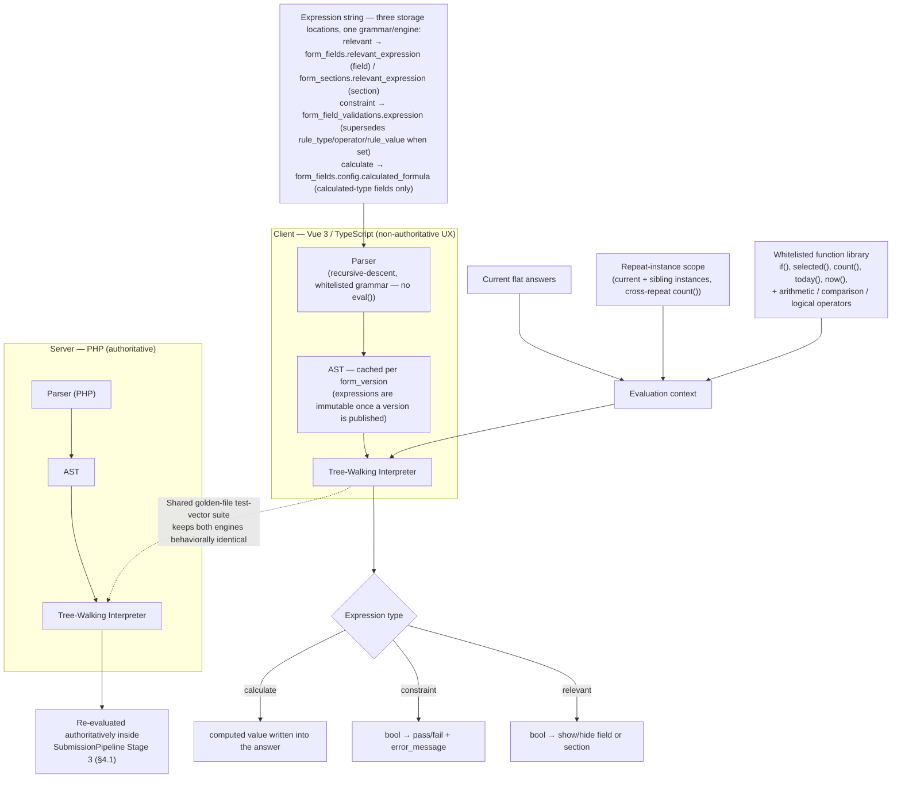

# Technical Architecture Document

**Product**: Form-Builder & Data-Collection SaaS Platform (working name: *the Platform*)
**Document status**: Draft v0.1 — first architecture artifact written against the approved plan, authored before any migration or application code exists
**Owner**: Engineering / Architecture
**Last updated**: 2026-07-03
**Source of truth for product/architecture decisions**: `hi-lets-create-a-federated-meteor.md` (the approved plan). This document expands that plan's §2 (Architecture) into implementation-grade detail; it does not introduce new product direction.
**Related documents** (see plan §4 for the full list; several are referenced throughout and are written alongside or after this one): PRD, Domain Glossary, Data Dictionary, ERD, Architecture Decision Records (ADRs), Multi-Tenancy & RBAC Design Doc, Form Versioning & Schema Migration Design Doc, API Specification (OpenAPI 3.1), Webhook & Integration Design Doc, XLSForm Interop Spec, OCR Pipeline Design Doc, Offline-First Sync Design Doc, Security & Threat Model Doc, Non-Functional Requirements Doc.

> **How to read this document**: Sections 2–4 use the [C4 model](https://c4model.com/) (Context → Container → Component) rendered as Mermaid diagrams. Sections 5–7 are cross-cutting architectural concerns that don't fit cleanly into a single C4 layer but are the highest-blast-radius parts of the system. Section 9 flags known risks explicitly rather than presenting a false picture of certainty. Wherever the approved plan was silent on a fine-grained detail, this document makes a concrete, reasonable choice and marks it with a **Decision** callout; all such decisions are also collected in Appendix A for easy scanning and later ratification via ADR.

---

## Table of Contents

1. [Overview & Scope](#1-overview--scope)
2. [C4 Context Diagram](#2-c4-context-diagram)
3. [C4 Container Diagram](#3-c4-container-diagram)
4. [Component-Level Detail](#4-component-level-detail)
   - 4.1 [Submission Pipeline](#41-submission-pipeline)
   - 4.2 [Offline Sync Engine](#42-offline-sync-engine)
   - 4.3 [Expression Evaluator](#43-expression-evaluator)
5. [Multi-Tenancy Architecture](#5-multi-tenancy-architecture)
6. [Form Versioning Architecture](#6-form-versioning-architecture)
7. [API & Integration Architecture](#7-api--integration-architecture)
8. [Technology Stack Summary](#8-technology-stack-summary)
9. [Key Architectural Risks & Mitigations](#9-key-architectural-risks--mitigations)
- [Appendix A: Decisions Made Where the Plan Was Silent](#appendix-a-decisions-made-where-the-plan-was-silent)

---

## 1. Overview & Scope

### 1.1 Purpose

This document describes the technical architecture of the Platform: a multi-tenant SaaS form-builder and data-collection product that hybridizes KoboToolbox-style research/M&E rigor (repeat groups, an XPath-like expression engine, offline-first collection, XLSForm interoperability) with Fillout-style commercial polish (drag-drop building, conditional logic, embeds, payments). It is the primary reference for engineers making structural decisions — service boundaries, data flow, tenancy enforcement, versioning semantics, and integration contracts — before implementation begins.

### 1.2 Relationship to the Legacy System

The plan is explicit that the legacy system (`dev_pk_new`, a Laravel/Inertia app built for Philippine DOH health-data collection) is **inspiration, not inheritance**: it proves the feature set is buildable and supplies verified-good patterns (a unified submission pipeline, a no-`eval()` expression engine, a `morphMany`-based audit trait, separate-table repeat-group storage) alongside confirmed anti-patterns to deliberately avoid (god controllers, magic-number enums, a display-only version string with no FK linkage, ad hoc file-path columns, an app-level switch-statement standing in for a real polymorphic relation). This document uses the legacy schema only as grounding for concrete column/entity choices — table and column names are renamed per the plan's mapping (e.g., `indicators` → `form_fields`, `indicator_groups` → `form_sections`, `form_submissions` → `submissions`) and are never copied verbatim. Full column-level detail lives in the Data Dictionary, not here.

### 1.3 Scope

**In scope for this document:**
- System-level and container-level architecture (C4 Context and Container diagrams).
- Component-level detail for exactly three components explicitly flagged in the plan as the highest-complexity, highest-risk pieces of new engineering: the Submission Pipeline, the Offline Sync Engine, and the Expression Evaluator.
- Multi-tenancy enforcement as a cross-cutting, layer-by-layer architectural concern.
- Form versioning as a cross-cutting architectural concern (it touches the data model, the API, the builder UX, and offline sync simultaneously).
- API and integration architecture at the level of resource shape, auth model per caller type, export modes, and webhook reliability mechanisms.
- A consolidated technology stack summary and its rationale.
- Known architectural risks and their mitigations, stated candidly.

**Out of scope for this document** (owned by other artifacts listed in plan §4):
- Column-by-column schema definitions, types, nullability, and PII classification → **Data Dictionary**.
- Full entity-relationship diagrams → **ERD**.
- The formal, versioned request/response contract → **OpenAPI 3.1 spec**.
- Detailed webhook event catalog and payload schemas → **Webhook & Integration Design Doc**.
- XLSForm column-by-column mapping → **XLSForm Interop Spec**.
- Threat modeling, attack surface enumeration, and OWASP ASVS mapping → **Security & Threat Model Doc**.
- UI/UX component tokens and page-layout rules → **UI/UX Design System Reference**.
- Performance/availability SLOs and compliance targets → **Non-Functional Requirements Doc**.
- Formal build-vs-buy justification for the form-rendering engine → the **Phase 0 spike ADR** (`docs/adr/0004-form-rendering-engine-build-vs-buy.md`, **Accepted 2026-07-09: build custom** — both SurveyJS and Form.io were gate-disqualified on XLSForm expression semantics (C1) + a PHP server-authority path (C2); executed via `docs/spikes/form-engine-spike-plan.md`). This document's "build custom" baseline is now the **ratified decision, no longer contingent** (Risk R7 in §9 resolved).

### 1.4 Architectural Goals / Quality Attributes

These goals, drawn directly from the plan, drive every trade-off made in this document:

| Goal | Why it matters here |
|---|---|
| **Tenant-isolation safety** | Highest blast-radius mistake category for a multi-tenant SaaS product; legacy had zero precedent (it was single-tenant), so there is no institutional muscle memory to lean on — enforcement must be structural, not cultural. |
| **Versioning integrity** | Legacy's single most consequential confirmed gap (`forms.version` is a free-text display string with no FK linkage); this must be structural from day one, not retrofitted. |
| **Offline-first correctness** | Genuinely new engineering (legacy's only "offline" story was print-and-photograph); idempotency and conflict handling must be correct on day one, not iterated into correctness later. |
| **One unified data-entry path** | Legacy's four divergent, drifted validation code paths is a named cautionary tale; the Submission Pipeline must be the *only* way data enters the system, from day one, across all six channels. |
| **Extensibility** | New field types, new submission channels, and new integrations must be addable without touching the pipeline's core stages. |
| **Auditability & compliance-readiness** | GDPR/health-data context (M&E use cases) requires PII classification, audit trails, and export/erasure to be architected in, not bolted on. |
| **Accessibility & responsiveness by default** | WCAG AA and mobile-first are build-time constraints on the public runtime, not later polish. |

---

## 2. C4 Context Diagram

The Platform sits between three classes of human/system actors and four external services. Guest/respondent traffic, tenant-admin traffic, and programmatic integration traffic are architecturally distinct from the very first request — this distinction is what drives the Container-level split in §3.

**Notes on actors:**
- **Tenant Admin** is a role family, not a single role: it encompasses org owners, form builders/owners, and validators/reviewers (the plan's role-aware dashboard already assumes this spread). Fine-grained role definitions belong to the Multi-Tenancy & RBAC Design Doc.
- **Respondent/Guest** may also be an *authenticated* internal staff member doing manual encoding — the same Public Runtime container serves both; the difference is purely in the auth credential presented (see §7).
- **Integration/Webhook Consumer** is bidirectional: it both *receives* webhook deliveries pushed by the Platform and *calls* the REST API directly (e.g., a Zapier polling trigger, a customer's nightly export puller).
- A **Super-admin** (internal platform operator) actor exists but is intentionally omitted from this customer-facing context diagram; it is covered in §5 as a cross-cutting tenancy concern, not a first-class external actor.

---

## 3. C4 Container Diagram

> **Decision**: the Admin/Builder application and the versioned REST API are **one Laravel deployable** (single codebase, single release train), logically separated by route-group/namespace — a modular monolith, not separate microservices. This is consistent with the plan's recommendation to avoid a second unforced architectural bet and with the self-hosted deployment model (**ADR-0005**): one web process group (nginx + PHP-FPM) + one Horizon worker process group + one scheduler + one Reverb process, all built from the same codebase. The Public Runtime SPA/PWA is the one genuinely separate deployable, per the plan's explicit call-out that it must not be Inertia-coupled.

**Container responsibilities:**

| Container | Responsibility | Notes |
|---|---|---|
| Admin/Builder Application | Form builder UI, submission review/inbox, dashboards, tenant/user/role management, billing UI | Inertia server-rendered; same-origin session auth; never consumed cross-domain. |
| Versioned REST API (`/api/v1`) | All programmatic access: Public Runtime, offline sync, integrations, webhooks-in (Stripe) | The *only* Platform-owned surface with an OpenAPI 3.1 contract; embeds and third-party integrations depend on its stability. |
| Queue Workers | Async execution of pipeline post-persist stages, exports, OCR extraction calls, webhook delivery, notification sending | **As of ADR-0007: the `database` queue driver on Postgres, driven by a plain `queue:work` process — Horizon is deferred, not adopted.** Horizon's per-queue observability (depth, throughput, failed jobs) that the Observability doc assumes is therefore **not built**; ADR-0007 §D12's structured `failed()` logging is the interim contract. Tenant-scoped jobs extend `TenantAwareJob`; cross-tenant work is a `MaintenanceJob` (ADR-0007 §D2/§D3). |
| Scheduler | Cron-driven periodic jobs: webhook retry sweep, usage-counter rollups, subscription reconciliation, data-retention purges | **Not yet implemented — specified by ADR-0007.** `routes/console.php` is stock and there is no `withSchedule`; the design is `Schedule::job(...)` declarations running `schedule:run` every minute, each scheduled task dispatching to the queue rather than running inline, so a slow task can't block the scheduler tick. Built in H2. |
| Reverb | Realtime channel server for live dashboards, builder presence, and "your queued submissions can now sync" push triggers to the PWA | Treated as a UX enhancement, not a hard dependency — see Risk R10 in §9. |
| PostgreSQL | System of record; RLS-enforced tenant isolation; JSONB+GIN for submission payloads; PostGIS for geo field types (Phase 2) | See §5 for RLS mechanics. |
| Redis | Cache, rate limiting, webhook idempotency dedupe cache, Reverb pub/sub backplane | **No longer the queue broker as of ADR-0007 §D1** — the queue runs on Postgres via the `database` driver; Redis+Horizon is the documented upgrade path, not the current state. Single Redis instance is sufficient at MVP scale; can be split (cache vs. pub/sub) later without app changes since each use goes through its own Laravel config connection name. |
| Object Storage (S3-compatible) | Attachments, async export files, OCR source images, XLSForm import/export files | Namespaced `tenants/{tenant_id}/...`; see §5. |

---

## 4. Component-Level Detail

Per the plan's explicit scoping (§4 item 4), component-level diagrams are provided for exactly three components: the Submission Pipeline, the Offline Sync Engine, and the Expression Evaluator. These are the three pieces of new engineering with the highest correctness risk and the least legacy precedent to lean on safely.

### 4.1 Submission Pipeline

The Submission Pipeline is the single, unified code path through which **every** submission enters the system, regardless of channel. This directly reimplements and generalizes legacy's confirmed-good `SubmissionPipeline.php` (validate → integrity → semantic → persist), but — unlike legacy, where this consolidation happened only *after* four divergent per-channel paths had already drifted apart — it is built as the only path from day one, across all six channels: manual encoding, guest link, OCR-single, OCR-linelist, offline-sync replay, and API/bulk import.

Each channel's adapter is responsible only for translating its native input shape (an HTTP form-encoded request, an OCR extraction result, a batch of queued offline records, a bulk-import row) into the same `SubmissionPayload` DTO (`form_version_id`, `answers`, `attachments`, `source`, `client_submission_uuid`, actor context). The adapter never performs validation itself — that discipline is what prevents the four-divergent-paths failure mode from recurring.

**Design notes:**
- **Post-commit event dispatch is mandatory, not incidental.** Domain events (which drive webhook delivery and realtime pushes) are raised only after the enclosing transaction commits — never delivering a webhook for a submission that subsequently rolls back.
- **OCR channels never auto-commit low-confidence data.** OCR-single and OCR-linelist route through a confidence-scored review-and-correct screen (owned by the OCR Pipeline Design Doc) *before* the adapter ever calls the pipeline — by the time the pipeline sees the payload, it is being asserted as final, human-reviewed data, and is validated with exactly the same rigor as manual encoding. This is what prevents OCR from becoming a way to bypass semantic validation.
- **Idempotency is a pipeline-level concern, not a channel-level one.** `client_submission_uuid` uniqueness (`tenant_id`, `client_submission_uuid`) is checked as part of Stage 2 (Integrity) for any channel that supplies one (offline-sync replay, and optionally API import) — a duplicate replay is treated as a successful no-op, not an error (see §4.2).
- **Linelist batches fan out to N independent pipeline invocations**, one per detected row, each with its own `client_submission_uuid`; a partial failure (e.g., row 7 of 40 fails semantic validation) does not roll back the other 39 — each row's outcome is tracked independently in the review UI.

### 4.2 Offline Sync Engine

This is the most genuinely greenfield component in the system — legacy's only "offline" story was print-blank-PDF → fill on paper → photograph → OCR extraction, a fundamentally different model from "fill digitally offline, queue, sync." The architecture follows the plan's three-layer design: service worker (cache-first assets, network-first API data), IndexedDB via Dexie.js as the client's source of truth, and the Background Sync API to replay the queue on reconnect.

**Design notes:**
- **Versioning and offline sync directly reinforce each other.** Because the manifest pins to a specific `form_version_id`, a device that downloaded version 3 keeps collecting safely against version 3 even after the tenant republishes version 4 on the server — no mid-collection schema surprise is possible. See §6.
- **Server timestamp is authoritative for ordering**; the client-supplied timestamp is stored but treated as informational only, since offline device clocks cannot be trusted for conflict resolution.
- **Conflict policy is deliberately simple for MVP**: last-write-wins via server timestamp for the dominant single-device-per-respondent case; a genuine concurrent edit (same `client_submission_uuid` resubmitted with materially different answers, or an authenticated-encoder edit racing an offline replay of the same record) surfaces a 409 for manual merge rather than silently resolving. CRDT-based merge is explicitly deferred (per the plan) unless concurrent multi-device editing of the same record proves common in practice.
- **Media attachments sync independently of the submission record itself**, using resumable multipart upload with per-chunk retry, and are only linked to the submission once both sides confirm receipt — this avoids a large photo/video upload blocking or corrupting the (much smaller, higher-priority) structured-answer replay.
- > **Decision (not pinned by the plan):** after 5 silent Background-Sync retry cycles without success, the client surfaces a "needs attention" banner rather than retrying invisibly forever — silent indefinite failure is a worse offline UX failure mode than an occasional interruption.
- > **Decision (not pinned by the plan):** client-generated identifiers use a time-sortable format (e.g., UUIDv7/ULID) rather than random UUIDv4, both to minimize collision probability across many offline devices and to make the eventual `client_submission_uuid` useful for coarse chronological ordering during conflict review.

### 4.3 Expression Evaluator

> **Confirmed by ADR-0004 (Accepted 2026-07-09 — build custom).** The build-vs-buy spike chose *custom*: neither SurveyJS nor Form.io offers a **PHP** evaluator behaviorally identical to its JS engine, so the two-engine (TypeScript + PHP) golden-file-locked design below — which is only cleanly achievable when we control both engines — stands as the authoritative approach. (Risk R7 resolved.)
>
> **Implementation status (2026-07-11).** The engine ships and is at **grammar v2.0** (`ExpressionEvaluator::GRAMMAR_VERSION` / `resources/public-runtime/engine` `GRAMMAR_VERSION`, held byte-identical by the shared `tests/golden/**` suite run through both engines — 180 expression + 55 validation vectors). Increment F2/F3 landed v1.0 (`= != > <`, `and`/`or`/`not()`, `selected()`); Increment G1 added repeat-instance scoping; **Increment G3 (PR #29) added the rest of the grammar below**: arithmetic `+ - * /`, the `>=`/`<=` comparators, and the value function library `if()`/`count()` (over G1 repeat instances + multi-select)/`int()`/`today()`/`now()`, plus `calculate` → `SemanticResult.computed` write-back. **One deviation from the design:** `today()`/`now()` read an injected clock on the evaluation context (an ISO-8601 string the caller stamps) so the two engines are deterministic and identical; and comparison (`> < >= <=`) is **numeric-only** — chronological ordering of ISO date strings is **deferred** (adding it would break the pinned "non-numeric operand → false" contract), so a date-range constraint like `${appt} >= today()` is not yet supported.

Models XLSForm's `relevant`/`constraint`/`calculate` expression grammar (`${field}` references, `if()`, `selected()`, cross-repeat `count()`, `today()`, `now()`, arithmetic/comparison/logical operators), carried forward as a first-class engine per the plan — both because it is confirmed valuable in legacy and because it is a concrete Kobo/ODK/SurveyCTO migration lever via bidirectional XLSForm import/export. One grammar and one pair of engines (TypeScript/PHP, below) serves all three expression kinds, but each kind is stored in a different column per the Data Dictionary — **not** all three in `form_field_validations` as a single flat concept: `relevant` lives directly on `form_fields.relevant_expression` (and `form_sections.relevant_expression` for section-level skip logic), `constraint` lives in `form_field_validations.expression` (where it supersedes the structured `rule_type`/`operator`/`rule_value` columns when set), and `calculate` lives inside `form_fields.config` as the calculated-type field's formula reference.

**Design notes:**
- > **Decision (not pinned by the plan):** the plan states "server-authoritative validation always — client-side is UX sugar only" as a general principle, and separately specifies the expression engine as first-class; this document makes explicit that the expression engine therefore exists as **two behaviorally-identical implementations** — a TypeScript port for live builder-time and respondent-time UX (instant show/hide-as-you-type, inline constraint hints) and the PHP engine as sole authority at submission time. This is the only architecturally consistent reading of both stated principles together, not an invention of new scope.
- **No `eval()`, no dynamic code execution, on either side** — both engines are hand-rolled recursive-descent parsers producing an AST, executed by a tree-walking interpreter over a closed, whitelisted function set. This directly carries forward legacy's confirmed-good `ExpressionEvaluator.php`/`FormulaEvaluator.php` no-`eval()` discipline (also referenced in the plan's Security & Threat Model scope as "expression-engine sandboxing").
- **ASTs are cached per `form_version_id`**, not re-parsed per submission — a direct consequence of immutable versioning (§6): once a version is published, its expressions never change, so parse results can be cached indefinitely (invalidated only when a new version publishes).
- **Cross-repeat aggregate functions** (`count()` over a repeat group's instances, sum-style calculated fields referencing repeat data) resolve against the specific submission's repeat-instance elements within the `submission_answers` JSONB array, scoped correctly even mid-fill (before a submission is persisted, evaluated against the in-progress client-side answer set).
- **Drift between the two engines is treated as a production defect, not an acceptable UX inconsistency** — see Risk R3 in §9 for the mitigation (shared golden-file test-vector suite consumed by both the PHP and TypeScript test runners in CI).

---

## 5. Multi-Tenancy Architecture

Multi-tenancy is architected as a system-wide constraint enforced independently at every layer a request or job passes through — never relied upon at only one layer — per the plan's explicit instruction. Default posture is a **shared database, shared schema**, with `tenant_id` as the discriminator (right for the large majority of SaaS products at this stage), using **`stancl/tenancy` v4**, with an explicit, non-rewrite escape hatch to isolate specific high-value or compliance-driven tenants later.

| # | Layer | Enforcement Mechanism | Failure Mode It Backstops |
|---|---|---|---|
| 1 | **Routing / DNS** | Tenant resolved from subdomain (`{tenant}.app.<domain>`) by an `IdentifyTenant` middleware that runs before session, auth, or any business logic. | A request being handled under the wrong (or no) tenant context from the very first line of application code. |
| 2 | **Identity & session** | Users belong to tenants via a pivot; Spatie Laravel-Permission's "teams" feature is keyed by `tenant_id`; the active tenant is carried as an explicit claim in the session/token. | A user authenticated against Tenant A silently exercising permissions scoped to Tenant B. |
| 3 | **Application / query (Eloquent)** | A `BelongsToTenant` trait + global `TenantScope` auto-applies `tenant_id = ?` to every query against tenant-owned models. | A developer forgetting a manual `where('tenant_id', ...)` clause on a new query. |
| 4 | **Database (Postgres RLS)** | A Row-Level Security policy on every tenant-scoped table, keyed off `current_setting('app.current_tenant_id')`; the application's DB role has RLS applied to it (explicitly **not** a superuser / `BYPASSRLS` role). | The ultimate defense-in-depth backstop — a raw SQL query, an ORM bug, a forgotten scope, or a compromised application code path still cannot read or write another tenant's rows, because the database itself refuses. Legacy had no equivalent of this layer at all. |
| 5 | **Background jobs / queue** | `tenant_id` is serialized into every queued job's payload; the `TenantAwareJob` base class asserts it is a uuid and re-establishes the RLS session variable inside `DB::transaction` as the first act of `handle()`, and a queue-event listener flushes the process-lifetime tenant statics on **both** edges of every job (ADR-0007 §D2/§D4). *Mechanism corrected 2026-07-21: this row previously described a "job middleware", which was never built — the sole existing job re-established context inline and nothing reset the statics between jobs.* | Queue workers execute outside the HTTP request lifecycle, so without this a job silently runs with no tenant context — or worse, leftover context from a previous job on a reused worker process. **That second failure mode was live until ADR-0007** — see its §Context item 6. |
| 6 | **Object storage** | S3 keys namespaced `tenants/{tenant_id}/...`; every presigned URL is generated per-request and re-validates the requesting user's tenant against the attachment record's own `tenant_id` before signing. | A guessable or leaked object key, or a stale cached URL, exposing another tenant's files. |
| 7 | **Cache & rate limiting (Redis)** | Cache keys namespaced `tenant:{tenant_id}:...`. **Rate limiting is two distinct mechanisms, and only the second is per-tenant:** (a) the **HTTP limiters** as built key on token-hash or IP, *not* tenant (`AppServiceProvider:105-127`) — deliberately, since `throttle:api` sorts ahead of auth so `$request->user()` is unresolved at that point; (b) the **per-tenant job-rate ceiling** (ADR-0007 §D9) is job middleware keyed `tenant:{id}:queue:{name}`, counting job executions rather than requests. | Cache-key collisions leaking data between tenants; one noisy tenant exhausting a shared rate-limit budget that starves every other tenant. |
| 8 | **Realtime (Reverb)** | Private/presence channels named `tenant.{tenant_id}.*`; the channel-authorization callback checks tenant membership before permitting a subscribe. | A WebSocket client subscribing to another tenant's live dashboard feed or sync-trigger channel. |
| 9 | **Public / guest endpoints** | Tenant is resolved from the form's signed share token (not session, not subdomain), since guests have no tenant membership; the token embeds `tenant_id` + `form_id` + `form_version_id` and is signature/expiry/revocation-checked before the RLS session variable is set for that request. | A guest link being replayed against a different tenant's data, or a forged/tampered token. |
| 10 | **Super-admin** | An explicit `users.is_super_admin` boolean, gated by a dedicated Gate/Policy; used only for legitimate cross-tenant platform-support tooling; every super-admin action is audited with the acting tenant recorded as platform-level (nullable), never silently inherited. | Legacy's fragile `users.id === 1` convention, duplicated across four code layers, which would silently transfer god-mode privileges if that row were ever deleted and the ID reused. |
| 11 | **Polymorphic associations** | Any "resource belongs to one of several parent types" relationship (e.g., a resource-scoping concept analogous to legacy's catchment-area assignment) uses a real Eloquent `morphTo` (`*_type` + `*_id`), resolved by the framework itself. | A hand-rolled `switch` on a level/type column silently doing the wrong (or nothing at all) for a type nobody added a case for — legacy's confirmed anti-pattern, with no real database FK. |
| 12 | **CI / automated isolation testing** | A dedicated tenant-isolation test pack runs on every PR touching a model or migration: seeds two tenants, attempts every plausible cross-tenant read/write/list operation, and asserts each one fails appropriately (404/403/empty result set). | A regression that passes ordinary feature tests (which typically exercise only one tenant at a time) but silently reintroduces a cross-tenant data leak. |
| 13 | **Isolation tiering (escape hatch)** | Default posture is shared DB/shared schema; `stancl/tenancy` supports promoting a specific tenant to an isolated schema or a fully separate database later. | Not a leak-prevention layer itself, but ensures that if a customer's contractual or regulatory requirements outgrow shared-DB isolation, the fix is a migration path, not a rewrite. |

> **Decision (not pinned by the plan):** tenant identifiers (`tenants.id`) are **UUIDs**, not auto-incrementing integers, because tenant IDs appear directly in subdomains-adjacent routing metadata, guest share-token payloads, and S3 key prefixes — a UUID avoids enumerability and keeps those surfaces consistent. Internal FK columns elsewhere may still use bigint identity columns for join performance; the definitive primary-key strategy per table is owned by the Data Dictionary.

> **Decision (not pinned by the plan):** the RLS session variable (`app.current_tenant_id`) is set via `SET LOCAL` inside the transaction that wraps each HTTP request/job (via middleware for HTTP, via job middleware for queued work), so it is automatically and safely cleared at transaction/connection-return boundaries rather than leaking across pooled-connection reuse.

---

## 6. Form Versioning Architecture

This is the direct fix for legacy's single most consequential confirmed gap: `forms.version` was a free-text display string, never auto-incremented, never linked to submissions — `form_submissions` FK'd directly to the live, mutable `forms.id`/`indicators.id`, so editing a form after data collection silently corrupted historical meaning. The new model mirrors ODK Central's draft/publish pattern (drafts are free and discardable; only publishing mints a permanent, addressable, immutable version) — an independently confirmed industry pattern for exactly this problem.

### 6.1 Lifecycle

```mermaid
stateDiagram-v2
  [*] --> Draft: Form created
  Draft --> Draft: Autosave builder edits (mutable, in place)
  Draft --> Published: Publish action\n(transactional snapshot + version_number increment)
  Published --> Draft: Edit after publish\n(opens a NEW draft; published row is never touched)
  Draft --> Published: Publish the new draft\n(mints version_number + 1)
  Draft --> Archived: Archive form\n(unpublished draft discarded)
  Published --> Archived: Archive form\n(all published versions retained for FK integrity)
  Archived --> [*]

  note right of Published
    Immutable once published.
    submissions.form_version_id FKs
    here and is never rewritten,
    even across future publishes.
  end note
```

### 6.2 Mechanics

1. **Exactly one mutable draft per form.** A form has at most one `form_versions` row with `status = draft`; builder edits (sections, fields, validations) upsert in place against this row's child records (`form_sections`, `form_fields`, `form_field_validations`, all FK'd to the draft's `version_id`).
2. **Publish is a single transaction** that:
   - Snapshots the draft's full structure into `schema_snapshot` (JSONB) on the version row — a denormalized, fast-to-retrieve copy used for rendering and offline manifests — **while the normalized `form_sections`/`form_fields`/`form_field_validations` rows remain independently queryable**, FK'd to that same `version_id`. Both representations are written together so they can never drift.
   - Sets `status = published`, assigns the next monotonic `version_number`, stamps `published_at`/`published_by`.
   - Updates `forms.current_published_version_id` to point at the newly published version.
   - Clones the just-published structure forward into a **brand-new** draft version row, so builder editing can continue immediately without ever disturbing the version that was just published.
3. **Submissions always FK to `form_version_id`**, never to `form_id` directly — this is the specific structural fix for legacy's confirmed bug. A device or session that started against version 3 keeps submitting safely against version 3's schema and expression definitions even after the tenant publishes version 4 (this is exactly what makes offline sync in §4.2 safe across a republish).
4. **A published version's fields are never mutated in place.** Application-layer service methods refuse any update against a `form_fields`/`form_sections`/`form_field_validations` row whose `version_id` belongs to a non-draft version.
   > **Resolved in `docs/form-versioning-schema-migration.md` §2**: the database-level guard extends the existing RLS `INSERT`/`UPDATE`/`DELETE` policies on `form_sections`/`form_fields`/`form_field_validations` with an additional `EXISTS` predicate requiring the parent `form_versions.status = 'draft'` — not a separate trigger mechanism, so this schema keeps one single DB-level-guard idiom (RLS) rather than two.
5. **Cross-version analytics align on a stable `form_fields.key`** (a slug preserved across versions for the same logical question), never by rewriting historical submissions to a new schema — a field can be renamed, restyled, or re-validated in a new version while its `key` keeps old and new submissions comparable in aggregate reporting.
6. **Rollback is forward-only.** "Rolling back" to an earlier version's shape is performed by publishing that old snapshot forward as a *new* `version_number` — old version numbers are never resurrected or reused, which keeps every submission's `form_version_id` reference permanently meaningful.
7. **Forms are soft-deleted only**; hard deletion is blocked while any submission references any of the form's versions, preserving referential and audit integrity.
8. > **Elaborated in `docs/form-versioning-schema-migration.md` §5**: still a Phase 2/3 UX enhancement, not a Phase 1 requirement — but Phase 1 already computes and stores the underlying field/section-level change classification (non-breaking / breaking-but-permitted / fork) on every publish, auto-populating `change_summary` with a plain-text summary even before the interactive diff view exists.

---

## 7. API & Integration Architecture

A versioned REST API (`/api/v1`) with an OpenAPI 3.1 contract is a first-class deliverable from day one — legacy never had one (Inertia server-rendered pages plus a handful of small JSON endpoints), which cannot support an offline client, third-party embeds, and integrations simultaneously.

### 7.1 REST Resources

| Resource group | Representative endpoints | Purpose | Typical caller(s) |
|---|---|---|---|
| Auth & API keys | `POST /api/v1/auth/tokens` | Issue Sanctum personal access tokens (scoped "API keys") | Tenant Admin (issues), Integration Consumer (uses) |
| Tenant | `GET/PATCH /api/v1/tenant` | Current tenant profile, branding, locale/settings | Admin App |
| Forms | `GET/POST /api/v1/forms`, `GET/PATCH/DELETE /api/v1/forms/{form}` | CRUD on the durable form record (metadata, guest-access config, capability flags) | Admin App, Integration Consumer |
| Form versions | `GET /api/v1/forms/{form}/versions`, `POST /api/v1/forms/{form}/versions/{version}/publish` | List/inspect immutable versions; publish the current draft | Admin App |
| Form draft | `GET/PATCH /api/v1/forms/{form}/draft`, `.../sections`, `.../fields`, `.../fields/{field}/validations` | Builder CRUD against the single mutable draft | Admin App |
| XLSForm interop | `GET /api/v1/forms/{form}/versions/{version}/xlsform`, `POST /api/v1/forms/{form}/draft/xlsform-import` | Bidirectional XLSForm exchange (full mapping in the XLSForm Interop Spec) | Admin App, Integration Consumer |
| Public form schema | `GET /api/v1/public/f/{shareToken}` — **implemented (Increment F5)** | Fetch the pinned `form_version` schema for rendering | Public Runtime (guest) |
| Submissions | `POST /api/v1/public/f/{shareToken}/submissions` (guest — **implemented F5**), `POST /api/v1/forms/{form}/submissions` (manual/API), `GET/PATCH/DELETE /api/v1/submissions/{submission}` | Create/list/review submissions through the unified pipeline (§4.1) | All caller types |
| Sync | `GET /api/v1/sync/manifest`, `POST /api/v1/sync/submissions` (batch) | Offline-first manifest fetch + idempotent batch replay (§4.2) | Public Runtime (PWA) |
| Attachments | `POST /api/v1/submissions/{submission}/attachments`, `GET /api/v1/attachments/{attachment}` (signed redirect) | Upload/retrieve polymorphic attachments | Public Runtime, Admin App |
| Exports | `POST /api/v1/forms/{form}/exports`, `GET /api/v1/exports/{export}` | Async chunked export job lifecycle | Admin App, Integration Consumer |
| OCR intake | `POST /api/v1/forms/{form}/ocr/single`, `POST /api/v1/forms/{form}/ocr/linelist`, `GET /api/v1/ocr/jobs/{job}` | Submit scans; poll extraction/review status | Admin App |
| Field library & templates | `GET/POST /api/v1/field-library`, `GET/POST /api/v1/form-templates` | Reusable question/form blueprints | Admin App |
| Webhook endpoints | `GET/POST/PATCH/DELETE /api/v1/webhooks/endpoints` | Tenant-configured webhook subscriptions | Admin App, Integration Consumer |
| Webhook deliveries | `GET /api/v1/webhooks/deliveries`, `POST /api/v1/webhooks/deliveries/{delivery}/redeliver` | Delivery observability + manual redelivery | Admin App |
| Users & roles | `GET/POST /api/v1/users`, `/api/v1/roles` | Tenant membership + Spatie-permission role assignment | Admin App |
| Subscription | `GET /api/v1/subscription` | Read current plan/quota (billing *actions* remain Cashier-driven Admin UI) | Admin App, Integration Consumer |
| Audit log | `GET /api/v1/audits` | Query the audit trail for a given resource | Admin App |

### 7.2 Authentication Per Caller Type

| Caller type | Credential | Notes |
|---|---|---|
| **Admin/Builder App** (tenant admin, in-browser) | Stateful session cookie + CSRF token | Standard Laravel session auth; Inertia is same-origin server-rendered, so Sanctum's SPA cross-domain mode is unnecessary here. Tenant resolved from subdomain + the authenticated user's tenant membership. |
| **Public Runtime — Guest respondent** | A signed, expiring share token scoped to exactly one `form_version_id` (embeds `tenant_id` + `form_id` + `form_version_id`) | No account, no session. Verified on every request: signature, expiry, and tenant/form/version match. Rate-limited per token and per IP. Optional single-use flag for invite-style distribution, configurable per tenant. **Implemented in F5** as an HMAC-SHA256 token minted at `GET /f/{slug}` on the tenant subdomain (`public_slug` is per-tenant); the token then carries tenant context to the subdomain-less `/api/v1/public` endpoints. F5 ships **reusable-until-expiry (24h default)**; the single-use flag needs persistence and is deferred. A republish is rejected at submit with `409 form_updated` (the SPA re-mints), keeping the shared pipeline strict. |
| **Public Runtime — Authenticated respondent** (e.g., internal staff doing offline manual encoding) | Sanctum personal access token, issued at login, stored client-side in the PWA | Scoped to the user's tenant + abilities; distinct from the guest-token path even though both use the same Public Runtime container. |
| **Integration / Webhook Consumer** (calling the API) | Sanctum personal access token ("API key"), scoped by ability (e.g., `read:submissions`, `write:forms`) | One key per integration, tenant-scoped, rotatable/revocable from the Admin UI, rate-limited per token. |
| **Stripe → Platform** (inbound billing webhooks) | Stripe webhook signature verification (Cashier's built-in signing-secret check) | Not a Sanctum-authenticated caller; verified via HMAC signature over the raw payload, per Stripe's standard mechanism. |
| **Platform → Integration Consumer** (outbound webhook deliveries) | HMAC-SHA256 signature (`X-Webhook-Signature` header), computed from a per-endpoint shared secret + timestamp | The inverse trust direction from the rows above — lets the receiving system verify the delivery genuinely originated from the Platform. Secret rotation supported with a dual-secret grace period (no downtime). |

### 7.3 Export Modes

- **Async / queued export** (the default for anything non-trivial): requests create an `exports` job row (`status = queued`); a Horizon worker streams/chunks the query (never loading the full submission set into memory — carrying forward legacy's confirmed-good memory-safe chunked-export pattern) into CSV/XLSX/PDF, writes the result to object storage under `tenants/{tenant}/exports/...`, and returns a signed, expiring download URL. Completion is signaled via email and a realtime (Reverb) push. This is always used for XLSX/PDF (heavier formats) and for any export beyond the cursor-pagination threshold below.
- **Sync / live-connect export**: a direct, cursor-paginated JSON/CSV streaming response for small or real-time consumption — e.g., a live Sheets/Airtable connector or a Zapier polling trigger.
  > **Decision (not pinned by the plan; the plan specifies "cursor-based pagination for exports beyond 1000 records" without a hard sync-mode ceiling):** the sync export path is capped at **5,000 rows or 30 seconds of processing, whichever comes first**; beyond that the API returns a structured `422` pointing the caller to the async export endpoint instead. This keeps the sync path bounded and predictable without a separate hard-coded row limit baked into client integrations.
- **XLSForm export/import** is treated as a distinct, spec-driven interchange format (not a generic "export mode" alongside CSV/PDF) — `GET .../xlsform` and `POST .../xlsform-import`, fully documented in the XLSForm Interop Spec, and always operating against a specific `form_version` (export) or the current draft (import target).

### 7.4 Webhook Reliability Mechanisms

- **Transactional, post-commit ingestion**: an internal domain event (`SubmissionCreated`, `FormPublished`, etc.) is raised inside the same transaction that persists the triggering write; a transaction-committed listener enqueues one `WebhookDispatch` job per subscribed endpoint — never dispatched pre-commit, so a webhook is never delivered for a write that subsequently rolls back.
- **Idempotency**: every domain event carries a stable `event_id` (UUID, generated once per event, not once per delivery attempt). The `webhook_deliveries` table enforces a unique constraint on `(endpoint_id, event_id)`, preventing duplicate delivery rows even if enqueueing happens twice; the `event_id` is also included in the outbound payload and as a header so the receiving system can dedupe independently. A Redis-backed dedup cache (TTL ~7 days) short-circuits redundant enqueue attempts before they ever reach the durable table.
- **Delivery envelope**: `POST` with the HMAC signature header (§7.2) and a versioned JSON envelope: `{ event_id, event_type, occurred_at, tenant_id, api_version, data }`. A 2xx response within a bounded timeout counts as success; anything else — including a timeout — counts as failure.
  > **Decision (not pinned by the plan):** delivery timeout is set at **10 seconds** (connect + response).
- **Retry with exponential backoff and jitter**: driven by a `next_retry_at` column swept by a scheduled job on the **`scheduled-maintenance`** queue (never a naive immediate re-queue loop). The sweep is a `MaintenanceJob` per ADR-0007 §D3 — it holds no tenant context and fans out per-tenant children — and inherits §D7's `$tries = 1` + `WithoutOverlapping` so a scheduler tick cannot double-sweep. Note the outbound-delivery half is **unbuilt**: there is no first-party outbound HTTP call site in the codebase today (see `docs/webhook-integration-design.md`).
  > **Decision (not pinned by the plan):** starting default retry schedule is **1m → 5m → 30m → 2h → 6h → 12h → 24h → 48h → 72h** (10 attempts total — the initial attempt plus 9 retries, spanning roughly 7 days, matching `webhook_deliveries.max_attempts`'s schema default of 10 in the Data Dictionary), after which the delivery moves to the dead-letter state. This concrete schedule is a starting point to be finalized in the Webhook & Integration Design Doc.
- **Per-endpoint circuit breaker**: after a run of consecutive failures the endpoint is automatically paused, and the tenant admin is notified, preventing a permanently-broken customer endpoint from silently consuming retry/queue capacity indefinitely. Re-enabling is a manual admin action that resets the breaker.
  > **Decision (not pinned by the plan):** the breaker opens after **20 consecutive failures**.
- **Dead-letter queue**: deliveries that exhaust all retries move to a DLQ state, visible in a per-tenant delivery-log UI, with a manual "redeliver" action.
- **Observability**: a per-endpoint delivery log (status, latency, response code/body snippet, attempt count) is surfaced to tenant admins; platform-level metrics (delivery success rate, queue depth, oldest pending delivery) feed the Observability & Incident Response doc's dashboards.
- **SSRF hardening**: endpoint URLs are validated against internal/private IP ranges at creation time (blocked by default; explicitly allow-listable for enterprise/on-prem integration cases).

---

## 8. Technology Stack Summary

| Layer | Technology | Rationale |
|---|---|---|
| Backend framework | **Laravel 11/12, PHP 8.3+** | First-party Horizon (queues), Sanctum (API auth), Cashier (billing), Reverb (realtime) map directly onto this project's hardest problems (multi-tenancy, RBAC, billing, async processing, audit trails) without assembling equivalents from separate packages; matches existing team expertise, avoiding a second unforced bet (new language *and* new domain model) on day one. |
| Multi-tenancy | **stancl/tenancy v4**, single-DB shared schema + `tenant_id` | 2026 production-standard package for exactly this posture; matches consensus guidance to start shared-DB and migrate specific high-value tenants to isolated DBs later without a rewrite. |
| RBAC | **Spatie Laravel-Permission**, tenant-scoped via its "teams" feature | Confirmed-good in legacy; the actual gap was tenant scoping (legacy was single-org) — fixed here, library not replaced. |
| Admin/builder frontend | **Inertia.js v2 + Vue 3 (Composition API) + TypeScript** | Matches existing team skill; TypeScript is a deliberate addition versus legacy (which had none) — nested form-schema data needs typed contracts to stay safe as the builder's data model grows. |
| Public form runtime + offline client | **Separate Vue 3 SPA/PWA on the versioned REST API — deliberately not Inertia** | Inertia has no offline story and cannot be embedded cleanly on third-party domains; this directly fixes legacy's confirmed biggest architectural gap ("no real API, Inertia-only"). |
| Form-rendering engine | **Custom** — decided via **ADR-0004 (Accepted 2026-07-09)** after the Phase-0 spike | Both SurveyJS and Form.io were gate-disqualified: neither natively speaks XLSForm (C1) nor offers a PHP evaluator identical to its JS engine (C2), which server-authoritative validation requires; partial-buy is dominated (the custom builder shipped in Increment D4). See ADR-0004 + `docs/spikes/form-engine-spike-plan.md`; Risk R7 resolved. |
| Database | **PostgreSQL 16+** | Native JSONB + GIN indexing (needed for the hybrid submission model), Row-Level Security (tenant-isolation backstop with no MySQL equivalent), PostGIS (legacy only stored geo as unindexed JSON strings). A deliberate departure from legacy's MySQL. |
| Queue / cache | **Queue: the `database` driver on Postgres (ADR-0007 §D1)** · **Cache: Redis** | Legacy ran with "no Redis in active use" — a real gap given webhooks, exports, and sync all need reliable async processing. The original **Redis + Horizon** choice is **superseded in part by ADR-0007**: nothing was ever installed and nothing was CI-verifiable, so the queue lands on the Postgres instance the app already depends on, where it runs identically in local Docker, Linux CI and on the Windows box. Redis+Horizon remains the documented, non-blocking upgrade path (jobs need no edit — it is a connection and supervisor swap); the trade-off accepted is **no queue dashboard** and lower throughput than a Redis broker. |
| Object storage | **S3-compatible**, one polymorphic `attachments` table | Replaces legacy's ad hoc `image_path`/`file_path`/`excel_path`/`pdf_path` column sprawl with one consistent model. |
| Realtime | **Laravel Reverb** | Live dashboards, builder presence, and sync-ready push triggers to the PWA; horizontally scalable via the Redis pub/sub backplane already in the stack. |
| Offline client | **Vue 3 PWA (Workbox)** + **Dexie.js/IndexedDB** + Background Sync API | Targets the genuine Kobo-style "fill offline, queue, sync" model that legacy had no equivalent of (only a print-and-OCR workaround). |
| Billing | **Laravel Cashier (Stripe)** | Subscription tiers mapped to feature flags and usage quotas; first-party integration with the rest of the Laravel stack. |
| CI/CD & infra | **Docker Compose** + GitHub Actions with **Larastan/PHPStan + Pint + Playwright + a real deploy stage** | Legacy shipped no committed Docker (despite Sail being a dependency) and CI that ran PHPUnit only — both are explicit, named fixes here. |
| Hosting | **Self-hosted on the team's own Windows Server 2016** (nginx + PHP 8.4 FastCGI + self-managed PostgreSQL + Redis via Memurai; Reverb as a Windows service, scheduler via Task Scheduler), deployed via a **self-hosted GitHub Actions runner** (push to main → auto pull/build/migrate/restart) — see **ADR-0005** (supersedes ADR-0003), as amended by **ADR-0007** (queue workers are a plain `queue:work` process, not Horizon). | Uses hardware the team already owns, so there is no managed-hosting bill; controlling PostgreSQL directly makes Row-Level Security and PostGIS **guaranteed available** rather than a platform capability to verify, and git-driven deploys keep releases simple. Accepted trade-offs: self-managed ops (patching, backups/WAL, pooling) and single-box availability (a single point of failure — see NFR §2). **Note the box is not yet stood up, and `deploy.ps1` currently provisions neither a worker service nor the scheduler task** (ADR-0007; Doc #22 §8). |
| Mobile | **PWA only** for MVP; native app deferred | Revisit only if enterprise/NGO customers need background GPS/biometrics beyond PWA capability. |

---

## 9. Key Architectural Risks & Mitigations

| # | Risk | Potential Impact | Mitigation |
|---|---|---|---|
| R1 | The hybrid JSONB-payload + typed-projection submission model (`submission_answers` JSONB + `submission_answer_index`) drifts out of sync | Filterable/sortable "hot-path" fields silently return stale or missing results while the JSONB source of truth is actually correct — a subtle, hard-to-detect data-integrity bug | The typed projection is written **transactionally in the same persist step** as the JSONB write (§4.1 Stage 4), never as a separate async job for hot-path fields; covered by pipeline integration tests; the Data Dictionary documents exactly which fields are projected and why. |
| R2 | A new tenant-scoped table is added via migration without an RLS policy and/or without the `BelongsToTenant` trait | A silent cross-tenant data leak that ordinary single-tenant feature tests won't catch | The CI tenant-isolation test pack (§5, layer 12); a migration-review checklist item; an ADR documenting the tenant-scoping pattern so new contributors follow it by default rather than rediscovering it. |
| R3 | The client (TypeScript) and server (PHP) Expression Evaluator implementations drift behaviorally | A field appears relevant/valid client-side but is rejected server-side (confusing respondent-facing errors), or worse, the client hides a field the server doesn't actually skip, risking silent data loss on submit | A shared golden-file test-vector suite run against both engines in CI; a deliberately small, versioned expression grammar; the server remains sole authority at submission time; client/server evaluation mismatches are logged as telemetry to catch drift in production before it accumulates. |
| R4 | Offline sync conflict/idempotency edge cases: device clock skew, `client_submission_uuid` collision, partial media upload | Duplicate or lost submissions; orphaned media; confusing conflict UX for respondents | Server timestamp is authoritative for ordering (client timestamp is informational only); time-sortable client IDs (UUIDv7/ULID) minimize collision risk; media uploads are independent of the submission record with their own resumable retry; the 409-conflict UX is designed as part of the MVP scope, not deferred. |
| R5 | Published-version immutability is enforced only at the application layer | A future code change (or a raw query bypassing the service layer) accidentally mutates a published version's fields, silently corrupting the historical meaning of past submissions — recreating exactly the bug this architecture exists to fix | A DB-level guard (trigger or check constraint) recommended in addition to the app-layer service methods (§6.2, flagged as a recommendation); code-review checklist item; covered by the Form Versioning & Schema Migration Design Doc. |
| R6 | ~~Webhook/export/OCR async infrastructure becomes a cost or noisy-neighbor surprise at scale (usage-sensitive managed hosting)~~ — **RESOLVED (2026-07-21)** | — | **Resolved by ADR-0007 (Accepted): a per-tenant job-rate ceiling as job middleware.** This risk previously carried three mutually contradictory commitments, all corrected here: the mitigation cited **§7.4**, which is *webhook reliability* and contains **no rate-limit mechanism** (a dangling pointer); §5 layer 7 claimed limiter buckets were already per-tenant, which was untrue of the HTTP limiters as built (they key on token-hash/IP); and `docs/non-functional-requirements.md` deferred per-tenant limiting to "Phase 2–3 … not before". **ADR-0007 §D9** replaces all three with a `RateLimited` job middleware keyed `tenant:{id}:queue:{name}`, counting job executions started per tenant per queue per minute — the only candidate that *defers* excess work rather than rejecting it. Ceilings live in `config/queue-fairness.php` with a plan-tier override hook; **§D10** keeps the state in the cache store so no new table is added (a `tenant_id`-bearing table would trip the migration linter, and both escapes — RLS in the reservation hot path, or an exempt table holding tenant identifiers — are worse). **Residual, tracked in ADR-0007:** the ceiling values are **unvalidated planning assumptions** — nothing has ever consumed this queue, so no throughput data exists; they are labelled as such and carry a revisit trigger on first real traffic. Horizon queue-depth monitoring is **deferred with Horizon** (§D1), leaving §D12's structured `failed()` logging as the interim observability contract. Built in H2. |
| R7 | ~~The build-vs-buy decision for the form-rendering engine is deferred to a Phase 0 spike~~ — **RESOLVED (2026-07-09)** | — | **Resolved by ADR-0004 (Accepted): build custom.** The Phase-0 spike gate-disqualified both SurveyJS and Form.io (no native XLSForm expression semantics / no PHP server-authority path) and found partial-buy dominated (the custom builder shipped in D4); §1.3, §4.3, and §8's custom baseline are confirmed as-is. No longer an open risk. |
| R8 | OCR/linelist extraction accuracy and the complexity of splitting one scanned sheet into many independent submissions | Incorrect data silently entering the system if extraction errors aren't caught, or an overwhelming manual-correction burden if the review UX is poor | A confidence-scored review-and-correct screen is mandatory before any OCR-derived data reaches the pipeline (§4.1); both OCR channels funnel through the exact same validation stages as every other channel, so bad OCR data cannot bypass semantic validation by construction. |
| R9 | Postgres RLS predicate evaluation adds per-query overhead at scale | Query latency regression under heavy multi-tenant load, particularly on high-cardinality tables like `submissions`/`submission_answers` | The RLS predicate is kept deliberately simple (an indexed `tenant_id` equality check only, no complex subqueries in the policy itself); load-tested during Phase 0/1; the isolation-tiering escape hatch (§5, layer 13) is available without a rewrite if a specific tenant's scale genuinely demands a dedicated database. |
| R10 | Reverb (realtime) scaling and connection limits across many tenants' live dashboards and sync-trigger channels | Degraded or dropped realtime UX at scale, or an outage in Reverb impacting perceived reliability | Channel namespacing per tenant; horizontal Reverb scaling via the existing Redis pub/sub backplane; realtime is architected as a UX enhancement with implicit polling/refresh fallback, never a hard dependency — offline sync in particular does not require a live connection, only a background-sync trigger on reconnect. |
| R11 | ~~Geospatial storage/index model + PostGIS-on-Windows availability + the map-picker/tile-source question were the one *undesigned* Phase-2 surface — PostGIS is called "guaranteed" (ADR-0005) but installed/verified in no environment, and the request-free guest runtime (ADR-0004 C3) conflicts with map tiles~~ — **RESOLVED (2026-07-12)** | — | **Resolved by ADR-0006 (Accepted): hybrid storage** — the GeoJSON envelope is the source of truth in `submission_answers.answers`, with a persist-time GiST-indexed PostGIS `geometry(4326)` projection (`submission_geo_index`) written atomically alongside it (the R1 pattern, extended to geometry); **capture** = a bundled, lazy-loaded Leaflet map over online OSM tiles atop a mandatory offline manual-lat/lon + GPS baseline (the field is never unfillable). The Linux-PostGIS path (extension privilege, `geometry(4326)`, GiST, GeoJSON round-trip, FORCE RLS under the `NOSUPERUSER` app role) is validated (`docs/spikes/geo-storage-spike-plan.md` §5.1). **Residuals, tracked in ADR-0006's Risks table:** PostGIS-on-Windows install is unverifiable from Linux CI (documented deploy-time StackBuilder + extension-owner grant + post-deploy smoke); the request-free posture is knowingly narrowed for the tile layer only (graceful offline degradation + a scoped CSP); offline map tiles are deferred to G8. Built in Increment G5b. |

---

## Appendix A: Decisions Made Where the Plan Was Silent

The plan is the source of truth for product/architecture direction; the following concrete, fine-grained choices were made in this document to produce a complete, unambiguous architecture, and are called out here collectively for easy scanning and later ratification via ADR:

1. **Tenant identifiers are UUIDs**, not auto-incrementing integers, because they appear in guest share-token payloads and S3 key prefixes and should not be enumerable (§5).
2. **The Admin/Builder Application and the versioned REST API are one Laravel deployable** (one codebase, modular by route namespace), not separate services — consistent with the plan's single-monolith recommendation and its instruction to avoid an unforced second architectural bet (§3).
3. **The RLS session variable is set via `SET LOCAL`** scoped to each request/job's transaction, so it cannot leak across pooled-connection reuse (§5).
4. **The Expression Evaluator exists as two behaviorally-identical implementations** (TypeScript for live UX, PHP as sole submission-time authority), kept in sync via a shared golden-file test-vector suite — the only architecturally consistent reading of the plan's "expression engine is first-class" and "client-side is UX sugar only" principles taken together (§4.3).
5. **A database-level guard is recommended, in addition to application-layer enforcement**, to make published-version immutability defense-in-depth rather than single-layer (§6.2).
6. **The sync/live-connect export mode is capped at 5,000 rows or 30 seconds of processing**, whichever comes first, before requiring the async export path; the plan specifies cursor pagination "beyond 1000 records" but does not pin an exact sync-mode ceiling (§7.3).
7. **Webhook retry schedule** (1m → 5m → 30m → 2h → 6h → 12h → 24h → 48h → 72h, 10 attempts total, matching the Data Dictionary's `max_attempts` default) **and circuit-breaker threshold** (20 consecutive failures) are concrete starting defaults, explicitly flagged as pending finalization in the Webhook & Integration Design Doc (§7.4).
8. **Webhook delivery timeout is set at 10 seconds** (connect + response) (§7.4).
9. **Guest share-tokens are signed, scoped to exactly one `form_version_id`**, with tenant/form/version embedded and verified per request; expiry and a single-use flag are configurable per tenant rather than globally fixed (§7.2).
10. **Offline sync surfaces a "needs attention" banner after 5 silent Background-Sync retry cycles**, rather than retrying invisibly forever or failing loudly on the first attempt (§4.2).
11. **Client-generated submission identifiers use a time-sortable format (UUIDv7/ULID)** rather than random UUIDv4, to minimize collision risk across many offline devices and support chronological conflict review (§4.2).
12. **A version-diff (draft vs. published) builder view** is flagged as a natural low-cost UX addition consistent with the plan's "intuitive by default" principle, but is not treated as load-bearing architecture (§6.2).

All twelve are candidates for promotion to formal ADRs as implementation begins; none contradicts or extends the plan's product direction — each fills in a level of detail the plan intentionally left to implementation-time judgment.
