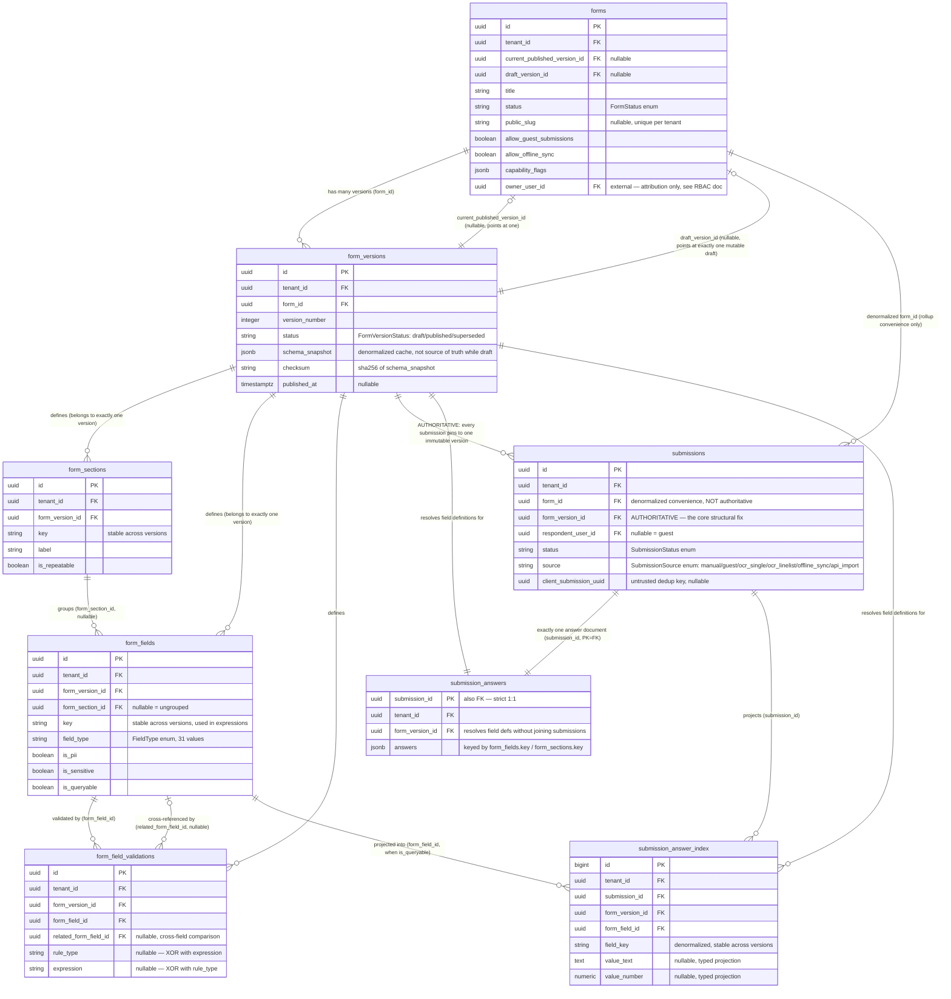

# Entity-Relationship Diagram (ERD)

**Project:** Form-Builder SaaS (`dev_formbuilder_app`)
**Status:** Draft v1.0 — derived directly from `docs/data-dictionary.md` (21 entities) and `docs/multi-tenancy-rbac-design.md` (9 additional entities: `users`, `tenant_users`, `resource_grants`, `scope_nodes`, `roles`, `permissions`, `role_has_permissions`, `model_has_roles`, `model_has_permissions`), for a total of 30 entities. `resource_grants` + `scope_nodes` replaced `form_collaborators` in Increment G10a.
**Purpose:** Two diagrams, per the architecture plan §4 item 6 — one full overview, one zoomed on the form/version/submission core. Diagrams use Mermaid `erDiagram` syntax, consistent with `docs/architecture/technical-architecture.md`'s existing C4 diagrams.
**Scope note:** This document shows relationships and enough attributes to read the diagram; it is **not** a substitute for the column-level detail in `docs/data-dictionary.md` and `docs/multi-tenancy-rbac-design.md` — those remain the source of truth for every column's type, nullability, default, and PII classification.

---

## 1. Tenant-Scoping Simplification (read this before the diagrams)

Per `docs/adr/0002-multi-tenancy-shared-db-rls.md`, **every table in this schema carries a `tenant_id` foreign key to `tenants.id`** except a short, explicitly-enumerated exemption list (`plans`, `role_has_permissions`, Laravel/Fortify framework-internal tables, and `user_ui_preferences`/`users`, which scope by `user_id` instead — see that ADR §D1 and `docs/multi-tenancy-rbac-design.md` §6). Five tables (`field_library`, `form_templates`, `settings`, `roles`, `permissions`) treat a `NULL` `tenant_id` as "global, visible to every tenant" rather than "no tenant" — ADR-0002 §D2.

Drawing all ~25 individual `tenants ||--o{ X` lines in the diagrams below would be pure repetition of that already-documented rule and would obscure the more informative *structural* relationships between the non-tenant entities. **The diagrams below deliberately omit tenant-scoping lines** and show only the structural/business relationships — treat "carries `tenant_id` → `tenants.id`" as implicit for every entity shown unless its own row explicitly says otherwise.

---

## 2. Full Overview

```mermaid
erDiagram
    forms ||--o{ form_versions : "has versions"
    forms ||--o{ resource_grants : "access scoped by (polymorphic)"
    scope_nodes ||--o{ resource_grants : "access scoped by (polymorphic)"
    scope_nodes ||--o{ forms : "groups (nullable)"
    scope_nodes ||--o{ scope_nodes : "parent of"
    forms |o--o{ webhook_endpoints : "scoped by (nullable = tenant-wide)"
    forms ||--o{ submissions : "collects (denormalized form_id)"
    forms ||--o{ attachments : "polymorphic attachable (forms)"

    form_versions ||--o{ form_sections : "defines"
    form_versions ||--o{ form_fields : "defines"
    form_versions ||--o{ form_field_validations : "defines"
    form_versions ||--o{ submissions : "collected against (authoritative FK)"
    form_versions ||--o{ submission_answers : "interprets answers for"
    form_versions ||--o{ submission_answer_index : "interprets projections for"
    form_versions |o--o{ form_templates : "sourced into (nullable)"
    form_versions ||--o{ attachments : "polymorphic attachable (form_versions)"

    form_sections ||--o{ form_fields : "groups"

    form_fields ||--o{ form_field_validations : "validated by (form_field_id)"
    form_fields |o--o{ form_field_validations : "cross-referenced by (related_form_field_id, nullable)"
    form_fields ||--o{ submission_answer_index : "projected into (when is_queryable)"
    form_fields ||--o{ attachments : "polymorphic attachable (form_fields, media samples)"

    submissions ||--|| submission_answers : "has exactly one answer document"
    submissions ||--o{ submission_answer_index : "projects queryable fields"
    submissions ||--o{ attachments : "polymorphic attachable (submissions)"

    users ||--o{ tenant_users : "one membership row per tenant"
    users ||--o{ resource_grants : "granted per-resource access"
    users |o--o{ forms : "owns / created / updated (attribution)"
    users |o--o{ submissions : "respondent / reviewer (nullable)"
    users |o--o{ audits : "acted (nullable = system action)"
    users ||--o| user_ui_preferences : "personalizes (unique)"
    users ||--o{ feedback_reports : "submits"
    users ||--o{ model_has_roles : "assigned via"
    users |o--o{ tenants : "last_active_tenant (UX convenience, not ownership)"

    roles ||--o{ role_has_permissions : "grants"
    permissions ||--o{ role_has_permissions : "granted by"
    roles ||--o{ model_has_roles : "assigned as"
    permissions ||--o{ model_has_permissions : "assigned as (schema present, unused Phase 1)"
    roles |o--o{ tenant_users : "reserved at invite (invited_role_id, nullable)"

    webhook_endpoints ||--o{ webhook_deliveries : "attempts"
    attachments |o--o{ webhook_deliveries : "archives oversized payload (nullable)"

    plans ||--o{ subscriptions : "subscribed to"
    subscriptions |o--o{ usage_counters : "meters (nullable)"

    attachments |o--o{ form_templates : "cover image (nullable)"
    attachments |o--o{ feedback_reports : "screenshot (nullable)"
    attachments |o--o{ tenants : "branding logo (nullable, direct FK)"

    tenants ||--o{ audits : "auditable events (nullable tenant_id)"
    submissions ||--o{ audits : "polymorphic auditable (representative example)"

    tenants ||--o{ google_auth_requests : "in-flight Google sign-ins (J3c2)"

    tenants ||--o{ point_awards : "gamification ledger (K1a)"
    users ||--o{ point_awards : "who earned it (external, single-column FK)"

    tenants ||--o{ badge_awards : "earned badges (K1b)"
    users ||--o{ badge_awards : "who earned it (external, single-column FK)"
```

**Reading notes:**
- **Neither gamification table has a line to the thing it is ABOUT, and in both cases that is the design** (K1a–K1b / ADR-0020 §D3, §D9). On `point_awards`, `subject_type`/`subject_id` name a form, a form version, a submission, a member — or, for `member.invited`, a SHA-256 of an email that references no row anywhere; a polymorphic pair with a non-row member cannot carry a database FK. On `badge_awards` there is **no subject column at all**: a badge is about a member's whole history against one `PointRule`, not about any single row, so there is nothing to draw and nothing to constrain. In both tables the only drawn relationships are the two that are real. `docs/data-dictionary.md` §31–§32 have the full shapes, including why `point_awards`' pair may never become nullable and why `badge_awards` stores no threshold.
- **`google_auth_requests` has no line to `users`, and its absence is the design** (J3c2 / ADR-0019 §D1). The person is the *outcome* of that flow, not a party to it: nobody is authenticated while any of its three rows-worth of writes happen. Where a Google account attaches to a local identity is `users.google_id` — a plain unique column, not a join table — so there is no relationship to draw. `docs/data-dictionary.md` §30 has the full shape, including why the central-host arm produces no row at all.
- **The SAML tables (`sso_connections`, `sso_auth_requests`, `sso_auth_failures`) are not drawn here either.** That is pre-existing and stated rather than quietly inherited: they form a self-contained protocol subgraph hanging off `tenants`, and `docs/data-dictionary.md` §27–§29 specifies them. A future pass may add an auth-subgraph diagram; adding four disconnected boxes to the overview would cost more legibility than it buys.
- `form_fields ||--o{ field_library` and `forms ||--o{ form_templates` (as *source*) are **intentionally not drawn** — both are copy-on-use blueprints (`docs/data-dictionary.md` §11–12's Design Notes: "instantiating a template clones this into a brand-new form... the new form never shares or references the template's own rows going forward"), not live foreign-key relationships. Only `form_templates.source_form_version_id` (a real, nullable FK for traceability) is drawn.
- `attachments`'s and `audits`'s polymorphic associations (`attachable_type`/`attachable_id`, `auditable_type`/`auditable_id`) have **no database-level foreign key** by design (`docs/data-dictionary.md` §10's Design Notes) — the lines above are illustrative of the relationship, not a literal constraint. Only the three or four most structurally central polymorphic targets are drawn per table for readability; `docs/data-dictionary.md` §13 and `docs/multi-tenancy-rbac-design.md` §7/§9 name the fuller list (`form_field_validations`, `webhook_endpoints`, `subscriptions`, `tenant_users`, `settings`, and others are also valid `auditable_type`/`attachable_type` values not drawn here).
- `model_has_roles`/`model_has_permissions`'s `model_id` is itself polymorphic (Spatie's own convention, `model_type` + `model_id`) — drawn here as a direct relationship to `users` only, since `users` is the only model type these tables reference in Phase 1 (`docs/multi-tenancy-rbac-design.md` §4).

---

## 3. Zoomed: Form / Version / Submission Core

The single most consequential structural relationship in this schema — and the direct fix for legacy's core, unversioned gap — is that **`submissions` FKs to `form_version_id`, an immutable snapshot, never to the live/mutable `forms`/`form_fields` rows.** This diagram exists specifically to make that chain unambiguous, per the architecture plan §2.3.

**Why this chain is drawn so explicitly:**
- `forms.current_published_version_id`/`draft_version_id` point *forward* at specific version rows, while `form_versions.form_id` points *backward* at the owning form — both directions are real, independently-maintained columns (not one derived from the other), which is why the diagram shows both arrows between `forms` and `form_versions`.
- `submissions` carries **both** `form_id` (denormalized, for "all responses to this form regardless of version" dashboard rollups) **and** `form_version_id` (the actual immutable, structurally-authoritative link) — `docs/data-dictionary.md` §7's Design Notes are explicit that these answer different questions and neither is redundant with the other.
- `form_sections`/`form_fields`/`form_field_validations` all belong to exactly one `form_version_id`, never directly to a `form_id` — editing a published version's fields is structurally impossible (`ON DELETE CASCADE` only ever fires on a discarded, unpublished draft's own rows, per `docs/data-dictionary.md`'s cascade-behavior summary).
- `submission_answers` is a strict 1:1 with `submissions` (its primary key **is** the foreign key, no surrogate `id`) — drawn as `||--||` to make that tightness explicit, unlike every other one-to-many relationship in this diagram.
