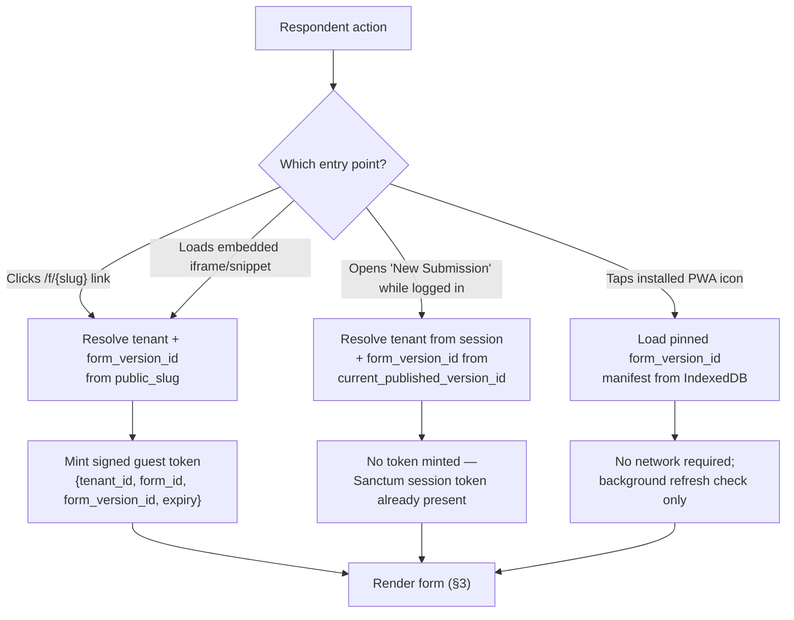

# Form-Filling UX Flow Spec

**Product**: Form-Builder & Data-Collection SaaS Platform (working codename "Meridian")
**Document status**: Draft v1.0 — written against the approved architecture plan, the PRD, the Technical Architecture Doc, and the Data Dictionary; precedes any front-end implementation.
**Owner**: Product / UX
**Last updated**: 2026-07-03
**Source of truth for product/architecture decisions**: `hi-lets-create-a-federated-meteor.md` (the approved plan). This document is plan artifact **#20**, "Form-Filling UX Flow Spec," and expands the plan's one-line description ("partial-save/resume, single-page vs. multi-step mode, progress/error UX, embed vs. standalone vs. offline presentation") into a complete, concrete flow specification. It introduces no new product direction — every decision below either restates an already-approved requirement or fills in a fine-grained gap the source documents left to implementation-time judgment, each such judgment call explicitly flagged with a **Decision (not pinned by the plan)** callout, following the convention established in the Technical Architecture Doc.

**Relationship to Doc #19 (UI/UX Design System Reference)**: that document (drafted in parallel) owns the visual and component system — design tokens, the component library (inputs, buttons, badges, the progress-indicator component, the app shell), and the general accessibility baseline (colour contrast, focus-visible styling, keyboard navigability) applied uniformly across the whole product. **This document does not redefine any of that.** It owns the *flows and interaction sequences* assembled from those components specifically for the act of filling out and submitting a form — sequencing, state transitions, timing, and the flow-specific accessibility behaviours (announcements, focus management on navigation) that sit on top of the Design System's baseline rather than duplicating it. Where a component is referenced below, it is referenced by name only (e.g., "the standard progress-indicator component," "the standard inline-error component") — its visual design is out of scope here.

**Related documents**: PRD (`docs/PRD.md`, esp. Features #3, #5, #7, #8), Technical Architecture Doc (`docs/architecture/technical-architecture.md`, esp. §4.1 Submission Pipeline, §4.2 Offline Sync Engine, §4.3 Expression Evaluator, §6 Form Versioning), Data Dictionary (`docs/data-dictionary.md`, esp. `forms`, `form_sections`, `form_fields`, `submissions`, `submission_answers`), UI/UX Design System Reference (Doc #19, parallel), OCR Pipeline Design Doc (Doc #17, owns the OCR review-and-correct screen — a related but distinct respondent-adjacent flow, out of scope here), Offline-First Sync Design Doc (Doc #18, owns the full sync engine architecture this document only describes from the respondent's point of view), Workflow Branching & Step-Graph Design Doc (Doc #27, `docs/workflow-branching-design.md` — owns the step model this document's §3.1/§3.2 describe from the respondent's point of view: what a step *is*, the three visibility predicates, and the degenerate shapes §3.2's dynamic recount does not cover).

---

## 1. Scope

This document specifies the **respondent-facing form-filling experience** — the flow a person goes through to see a form, fill it in, and submit it — across every channel and device Meridian supports. It does not cover the builder/admin experience (designing a form, configuring logic, reviewing submissions in the inbox); that is covered by the builder-UX guidance in Doc #19 and the forthcoming builder-specific flow documentation implied by PRD Feature #8.

Per Product Principle 3.1 and PRD §2.4/§5 Feature #7, **manual encoding by an authenticated user follows exactly the same fill flow described in this document**, field-rendering component for field-rendering component, validation behaviour for validation behaviour. The only differences are:

- No guest-identity resolution step (§2) — the respondent is already authenticated, so `respondent_user_id` is set from the session instead of leaving it `NULL`.
- No guest token is minted; the authenticated Public Runtime session uses a Sanctum personal access token (Technical Architecture §7.2) instead of a signed share token.
- The post-submit experience (§9) differs slightly — an authenticated encoder gets a link back into the tenant's submissions inbox that a guest, having no account, cannot be given.

> **As built (H21c) — this claim was ASPIRATIONAL until Increment H21c, and Doc #27 §7 is where that was first written down.** For the whole of Phase 1 and most of Phase 3 the encode page rendered a flat `blocks` list with no step model, no `single_page_mode` read and no relevance at all: the keyer saw every branch, and the pipeline pruned what they typed at submit without telling them. H21c makes the sentence true by mounting the guest runtime's own store (`createFormRuntime()`) on the encode page, so the two channels now share one implementation of the step list rather than agreeing by construction.
>
> **Three differences remain, and they are the list above plus two more, both deliberate:**
>
> - **A keyer-only "Reference fields" block.** A `url`-sourced `hidden` field is invisible to a respondent by definition, but a keyer transcribing paper is the only possible source of its value (H7; `data-dictionary.md`'s read/render asymmetry). Where such a field's whole section is absent from the step list — which is always, if the section holds nothing else — the encode page renders it in a labelled block outside the steps. The STEP LIST itself stays byte-identical to the guest's, which is what lets Doc #27 §9's parity suite assert a clean equality.
> - **The encode channel is single-locale.** It resolves no `*_translations` and emits its form's default locale alone, so the language switcher never appears. The guest channel gets the full `supported_locales`.
>
> And one behaviour that reads like a difference but is the same rule reached from the other side: **Next never blocks on the encode channel.** The guest's `attemptNext()` refuses to advance past a step holding errors, which is right for someone answering about themselves and wrong for staff transcribing a document that may simply be incomplete. The pipeline stays the sole validation authority (the F4b contract), and Submit raises the same **form-wide** error summary §5.5 requires, whose jump links change step before they focus.

Everywhere else in this document, "respondent" means both the guest filling a public link and the authenticated user doing manual encoding, unless a subsection explicitly calls out a guest-only or authenticated-only behaviour.

This document also does not cover: the OCR-single or OCR-linelist review-and-correct screens (Doc #17 — these are a *reviewer* correcting extracted data, not a respondent filling a live form, even though both ultimately pass through the same Submission Pipeline); the builder's live-preview pane (Doc #19 / Feature #8); or the tenant-admin submissions inbox/review UX.

---

## 2. Entry Points

A respondent reaches a fillable form through exactly one of four entry points. What's captured or resolved differs by entry point but the field-rendering and validation UX (§3–§4) is identical from that point forward.

| Entry point | Phase | How it's reached | What's resolved/captured at entry |
|---|---|---|---|
| **Guest public link** (`/f/{slug}`) | 1 (MVP) | A shared URL, QR code, or paper flyer pointing at the form's `public_slug` | Tenant resolved from the share token minted for this request (never from session — Technical Architecture §5, layer 9); the link resolves to `forms.current_published_version_id` (the form's live public version) and a signed, expiring, single-purpose token embedding `{tenant_id, form_id, form_version_id, expiry}` is minted for the session (Data Dictionary `forms` Design Notes — this token is stateless, never persisted as a row). `guest_ip` and `guest_user_agent` are captured at actual submission time, not at page load, and stored on the `submissions` row. No account is created at any point. |
| **Embedded iframe / script snippet** | 1 (MVP) | A `<script>` snippet or raw `<iframe>` on a third-party page (marketing site, partner portal) | Identical resolution to the direct guest link underneath — the embed loads the same Public Runtime SPA against the same `/f/{slug}` (or a dedicated embed-flavored route) and mints the same guest token. The only entry-specific behaviour is presentational (§3.4): the embed strips the standalone app chrome and negotiates height with the parent page. |
| **Authenticated manual-encoding entry** | 1 (MVP) | A tenant user with the appropriate role opens "New Submission" for a form from inside the product (Admin/Builder App or an authenticated Public Runtime session) | Tenant resolved from the authenticated session (subdomain + user's tenant membership), not from a share token. Resolves to the same `forms.current_published_version_id` a guest would see (a manual encoder always enters against the currently published version — there is no separate "draft-preview fill mode" in scope here). `respondent_user_id` is set to the encoding user's id; no guest token, no `guest_ip`/`guest_user_agent` capture (that data has no meaning for an authenticated actor — see §1). |
| **Installed PWA icon** (offline-capable forms) | 2+ | A respondent who previously visited a form with `forms.allow_offline_sync = true` installs the Public Runtime as a PWA (browser "Add to Home Screen" / install prompt); subsequent opens launch from the home-screen icon | No network round-trip required to open. The last-synced manifest — the pinned `form_version_id`'s schema, choice lists, and media references (Technical Architecture §4.2) — is read straight from IndexedDB. If the device is online at open time, a background manifest refresh check runs (network-first for API data per the service-worker caching strategy) but never blocks the respondent from immediately continuing to fill; if a newer version has been published, the respondent's current fill continues safely against the pinned version they downloaded (see §7) rather than being silently upgraded mid-fill. |

> **Decision (not pinned by the plan):** the embed route and the direct-link route resolve identically and mint the same token shape — Meridian does not maintain a functionally separate "embed API." This keeps one resolution code path for every browser-based entry point and avoids a second, divergent guest-identity mechanism purely for embeds.

---

## 3. Presentation Modes

### 3.1 Single-page vs. multi-step

Every form carries the `forms.single_page_mode` boolean (Data Dictionary §2) — the direct successor to the legacy system's flag of the same name, carried forward because it was confirmed-good and because a large share of respondents' mental model of "a form" is either "one scrollable page" or "a short wizard," not a single engine trying to be both badly.

- **Single-page mode** (`single_page_mode = true`): every section and field in the form's currently-resolved version renders in one continuous scroll, in `form_sections.sequence` / `form_fields.sequence` order, with one persistent **Submit** action at the end of the page. Sections still render as visually distinct groups (per Doc #19's section/card component) but there is no pagination and no progress indicator — the respondent's own scroll position *is* the progress indicator, which is why the standard progress-indicator component (§3.2) is not shown in this mode at all, rather than shown at a permanently-100% state.
- **Multi-step / paginated mode** (`single_page_mode = false`, the default for a newly-created form per the PRD's "clear, sensible defaults" principle — actually **Decision (not pinned by the plan):** the PRD states a new form "defaults to single-page mode," which this document treats as the literal default value of `single_page_mode = true`; multi-step is the opt-in): each **section** (`form_sections`) becomes one step. A respondent moves between steps with **Next** / **Back** actions; **Submit** appears only on the final step. A repeatable section (`is_repeatable = true`) is still one step in the step count — its per-instance "add another" affordance (Phase 2) lives inside that single step, it does not fan out into N steps. > **Amendment (Doc #27 §2.2, H21a): "each section becomes one step" is necessary but not sufficient — a step also requires at least one field that renders something AND at least one field that is currently relevant.** As built, the emptiness test consults only a static field-type predicate and never `fieldRelevance`, so a relevant section whose every field is individually gated off renders a heading, a Next button and no questions — which is the grayed-out-skipped-step experience §3.2 below explicitly rejects, reached through a different door. Under Phase 3 branching, conditioning on fields rather than on the section is the likelier authoring style, so this becomes the default outcome rather than an edge case; Doc #27 §2.2 pins the third predicate and states its cost.

Both modes render every field with **the same field-rendering components** — a `single_select` field looks and behaves identically whether it's field 4 of 40 on one long page or field 2 of 6 on step 3 of 5. `single_page_mode` governs pagination and chrome only; it never changes which component renders a given `field_type`, which is exactly what lets the builder preview (Doc #19/Feature #8) stay visually representative of both modes without a second component set.

### 3.2 The progress indicator (multi-step mode only)

- Lives at the top of the form content region, below the form title/branding and above the current step's content — a fixed anchor point respondents can always find, per the standard progress-indicator component from Doc #19.
- Displays **"Step X of N"** plus (space permitting) the current step's section title, using the standard progress-indicator component's step-count variant rather than a raw percentage bar — a labeled step count is more meaningful than a bar when N is small (the common case: most forms have well under 10 sections), and it gives screen-reader users (§10) a concrete, announceable position ("Step 3 of 5: Household Members") rather than an abstract percentage.
- **N is dynamic, not fixed at form-open time.** Because a section can carry its own `relevant_expression` (Data Dictionary §4 — section-level skip logic), an entire step can become irrelevant mid-fill based on an earlier answer. When that happens, the step is removed from both the step sequence and the total count **immediately**, before the respondent would otherwise navigate to it — the respondent never sees "Step 4 of 6 (skipped)"; they see "Step 4 of 5" recalculated as if the irrelevant section had never existed for this respondent. > **Decision (not pinned by the plan):** this dynamic-recount behaviour is not specified in the source documents; the alternative (a fixed step count with skipped steps visibly grayed out) was rejected because it exposes the form's *entire possible* logic surface to every respondent regardless of their own path through it, which is unnecessary and can be confusing for a non-technical guest. > **Amendment (Doc #27 §3.1/§4.1, H21b): the dynamic-recount decision STANDS; Doc #27 specifies the two shapes it does not cover.** (a) **N = 0** — every step irrelevant. As built this renders "Step 1 of 0" over an empty form with a live Submit button that succeeds, because `isLastStep` compares an index of −1 against a length of −1 and agrees. Doc #27 §4.1 suppresses the counter entirely at N = 0 and specifies a terminal panel instead. (b) **A step becoming relevant *behind* the respondent**, which a forward-referencing section condition makes routine: the count jumps from "Step 2 of 2" to "Step 3 of 3" with no announcement, and the newly-inserted step acquires a clickable "done" affordance it never earned, because completion is decided by comparing indices. Doc #27 §3.1 specifies insertion in document order, a **visited set** rather than an index comparison, and an announcement when N changes. > **As built (H21b):** both are closed. The progress indicator is suppressed entirely at N = 0 in favour of §4.1's terminal panel; `isLastStep` gained the `length > 0` guard that the −1 accident depended on; "done" is decided by the store's visited set, so a step that appears behind the respondent gets no dot until they actually reach it; and a change in N with no move is announced (see §10.1's amended rule).
- Each already-completed step is tappable/clickable to go back and revise an earlier answer (subject to the same skip-logic and validation rules re-evaluating on return — see §4).

### 3.3 How embedding affects presentation

An iframe/script-snippet embed (§2) renders the **same** Public Runtime, in either presentation mode, with two embed-specific adjustments:

- **Minimal chrome.** The standalone app shell's navigation and header (used when a respondent opens the form as its own page) are suppressed inside an embed; only the form content itself, plus a small, dismissible-by-tenant-setting "Powered by Meridian" footer (a monetization/attribution lever reserved for future tiering, not specified further here), renders inside the iframe.
- **Auto-height by default.** The embed snippet includes a small listener script on the parent page; the iframe's content posts its rendered height to the parent via `postMessage` whenever the content height changes (step navigation, a skip-logic show/hide event, a validation error appearing) and the parent resizes the iframe to match — so the embedded form never produces its own internal scrollbar or visible dead space by default. A **fixed-height** embed mode (internal scrollbar, static iframe height set by the tenant) is offered as an explicit opt-in for tenants who need a predictable, non-reflowing embed slot on their page (e.g., a form placed inside a fixed-height marketing-page card). > **Decision (not pinned by the plan):** auto-height is the default and fixed-height is the opt-in, not the reverse, because a form that changes length via skip logic (§4) is the common case, and a silently-clipped embedded form is a worse failure mode than an unexpectedly-resizing one.

---

## 4. Filling & Validation UX

### 4.1 Conditional/skip-logic show and hide (`relevant_expression`)

Every field (`form_fields.relevant_expression`) and every section (`form_sections.relevant_expression`) can carry an XLSForm-style `relevant` condition. The respondent-facing experience of a condition flipping is:

- **Smooth, not jarring.** A field or section transitioning between shown and hidden animates its height (an expand/collapse transition on the field-wrapper component, not an instant reflow) so surrounding content doesn't visibly jump. This is a flow-timing requirement on top of Doc #19's field-wrapper component, not a new component.
- **No silent data loss without a clear affordance.** When a field becomes irrelevant while it already holds a respondent-entered value, that value is **not** deleted from the client's in-progress state — it is retained (in the same client-side answer store the Expression Evaluator's TypeScript mirror already holds, per Technical Architecture §4.3) but excluded from what would currently be submitted, matching XLSForm `relevant` semantics (an irrelevant field's answer is not part of the submitted record). The first time this happens for a given field in a session, a brief, non-blocking inline note appears where the field used to be ("Your answer to '[Label]' won't be included because it's no longer relevant, based on your answer to '[X]'"), auto-dismissing after a few seconds. If the condition flips back to relevant later in the same fill (the respondent changes their earlier answer again), the field reappears with its **previously entered value restored**, not blank — the respondent is never made to re-type an answer they already gave. > **Decision (not pinned by the plan):** the source documents establish the "never disappear with data still in them without a clear affordance" requirement but not the specific mechanism; retain-and-restore plus a one-time dismissible note is the concrete choice made here, favoring "don't make the respondent redo work" over the alternative of clearing the field outright, which is the stricter XLSForm-purist behaviour some ODK clients use.
- A **section** becoming irrelevant hides/shows its whole step the same way (§3.2) — the step disappears from the progress indicator, and if the respondent is currently on that step when it becomes irrelevant (possible if an earlier step's answer changes on a "back" navigation), they are automatically advanced to the next relevant step rather than left stranded on a step that no longer exists. > **Correction (Doc #27 §4.2, H21b): "advanced to the next relevant step" is not what is built, and the difference is visible to the respondent.** The rescue clamps to `min(lastValidIndex, length − 1)` — an index recorded against the *old* step list, applied to the *new* one — so a step that hides itself along with everything before it moves the respondent **backwards**, potentially to step 1, and the announcement states the destination but never the reason. Doc #27 §4.2 specifies reconciling relative to the vanished step's *identity* (walk the previous ordered key list outward to the nearest survivor) and announcing why the move happened. §5.3 of that document extends the same rule to the resume cursor, where an unresolvable stored step currently restarts the respondent at step 1 in silence. > **As built (H21b):** the rescue walks the previous ordered step list **outward** from the vanished key — backwards to the nearest surviving predecessor first, then forwards when nothing precedes it — and the announcement leads with the reason ("The step you were on no longer applies…") before naming the destination. If the vanished step still held an answer, a step-level retained-answer note says so; in multi-step mode nothing could say it before, because no field wrapper for an off-screen step is mounted to fire the field-level note.

### 4.2 When validation errors surface

Meridian uses a **hybrid** model, deliberately not "errors only on submit" and not "aggressively validate every keystroke":

1. **Inline, on blur (or on change after the field has been touched once).** As soon as a respondent leaves a field (blur) or, for a field they've already triggered an error on once, on every subsequent change, the field is validated against its structural rules (`form_field_validations` — required, min/max length or value, pattern) and its `constraint` expression if one is set. A failing field shows the standard inline-error component immediately below it, using `form_field_validations.error_message` (or its localized `error_message_translations` entry per §6). This is the primary feedback loop while filling — it matches respondents' expectation from modern tools (Fillout-lite parity, PRD §8.3) and avoids the "wall of errors at the end" experience that Kobo-lite/legacy-style forms are sometimes criticized for.
2. **A summary banner appears only on a submit (or "Next," in multi-step mode) attempt that still has unresolved errors.** The banner lists every currently-failing field as a jump link; activating a link scrolls to and focuses that field (see §10 for the exact focus-management sequence). This is the safety net for errors a respondent hasn't triggered inline yet (e.g., a required field they skipped entirely without ever focusing it) — inline-on-blur alone cannot catch "never touched," so the submit-time summary is not redundant with it.
3. **A required field left empty does not show an error until the first blur/submit attempt** — an empty required field on first render is neutral, not already-red, consistent with not shaming a respondent for a field they haven't reached yet.

### 4.3 Client mirror vs. server authority

Per the Expression Evaluator's two-engine design (Technical Architecture §4.3): the respondent's `relevant`/`constraint` feedback described in §4.1–4.2 above is computed by the **client-side TypeScript engine**, giving instant, no-network-round-trip show/hide and inline-error behaviour as the respondent types. The **server-side PHP engine remains sole authority** — every field's `relevant`, `constraint`, and `calculate` expressions are re-evaluated, from scratch, inside the Submission Pipeline's Stage 3 (Semantic Validation) at the moment of actual Submit (Technical Architecture §4.1), regardless of what the client already showed.

This has one concrete, respondent-facing consequence the flow must handle gracefully: on the rare occasion the two engines disagree (flagged as Risk R3 in the Technical Architecture Doc, mitigated by a shared golden-file test suite but not something the UX can assume never happens), a submit attempt can come back from the server with a semantic error the client-side pass did not show. The respondent-facing behaviour for this case:

- The server's 422 response is mapped back onto the specific field(s) it names, rendered through the exact same inline-error component as a client-caught error (§4.2) — the respondent never sees a raw server error message or a technical exception.
- The summary banner (§4.2, mechanism 2) always re-appears in this case, even in single-page mode, since a server-side rejection is definitionally something the respondent hasn't already resolved.
- No submission is ever partially accepted — the pipeline's transactional persist (Technical Architecture §4.1 Stage 4) means the respondent's whole submit attempt either fully succeeds or is fully returned to them with errors to fix; there is no "we saved 8 of your 10 answers" state.

### 4.4 Visually distinguishing required / optional / conditional fields

`form_fields.is_required` is a three-state field (`RequiredMode`: `required`, `optional`, `conditional` — Data Dictionary §5), and it is a distinct concept from field-level *visibility* (`relevant_expression`, §4.1) — a field can be visible but only conditionally required (e.g., required only `if(${employment_status} = 'employed')` via a `required_if` rule in `form_field_validations`).

- **`required`**: label carries the standard required-field marker (an asterisk plus an `aria-required="true"` attribute, per Doc #19's field-label component) from the moment the field is shown.
- **`optional`**: label carries a muted "(optional)" suffix per Doc #19's field-label component — shown, not merely the absence of a marker, since an unmarked field reads ambiguously once some fields on the same screen do carry the required marker.
- **`conditional`**: the field shows **neither** marker by default. Only once its governing condition (a `required_if`/`required_with` rule, or an equivalent expression) actually evaluates true for the respondent's current answers does the required marker fade in (same transition treatment as §4.1's show/hide) — a conditionally-required field never displays a required marker for a condition that hasn't been triggered yet, since that would misrepresent the field's actual current requirement to the respondent looking at it. > **Decision (not pinned by the plan):** the specific rule that a `conditional` field is visually indistinguishable from `optional` until its condition triggers is a concrete interpretation not spelled out in the Data Dictionary, chosen because showing a marker that might not apply is a worse failure mode than a brief lack of a marker on a field the respondent hasn't reached the relevant condition for yet.

---

## 5. Save, Resume & Partial Submission

Two genuinely different capabilities ship in different phases and must not be conflated in the respondent-facing copy or behaviour:

### 5.1 Phase 1 — lightweight in-session save-as-draft

Per PRD Feature #7's acceptance criteria ("a basic in-session save-as-draft capability is available from Phase 1 for long forms — a lighter version of the full partial-submission/save-and-resume feature planned for Phase 3"):

- The respondent's in-progress answers are written to a `submissions` row with `status = 'draft'` (Data Dictionary §7) plus its `submission_answers` row, autosaved **without** invoking the full Submission Pipeline's integrity/semantic stages — a draft is, by definition, allowed to be incomplete or momentarily inconsistent, and running full semantic validation mid-fill would surface confusing constraint errors before the respondent has reached the fields a constraint depends on. > **Decision (not pinned by the plan):** the Technical Architecture Doc's pipeline diagram (§4.1) covers only the finalize-on-Submit path; this document establishes that draft autosave is a separate, lighter write path, invoked on field blur (debounced), on step navigation in multi-step mode, and on a periodic backstop timer (every 30 seconds while the tab is active), and that only the final **Submit** action ever invokes the full four-stage pipeline.
> **Amendment (Increment I9b) — the authenticated half of this is now DURABLE, and the sentence below is guest-only.** Manual encoding autosaves to the SERVER (`POST /forms/{form}/submissions/draft`), so a keyer's work survives a closed tab, a different machine and a cleared browser; the draft is listed in their inbox under the Draft filter with a **Continue this draft** action, and `GET /submissions/{submission}/resume` rehydrates the encode page from it. The tier and per-form rules below still hold and were deliberately NOT reused: the channel is ungated by plan (per §5.2's own "never gated behind a paid plan") and ignores `forms.save_and_resume`, which is the author's decision about RESPONDENTS. Expiry is unchanged and still stamped once at creation — I9b considered restamping on save and rejected it on scope, surfacing the expiry date in the resume banner instead.
>
> What remains guest-only below: the localStorage token, the emailed resume link, and the "no cross-device access" limitation.

- This save is **session/device-scoped, not a durable resume-later feature**: a lightweight token referencing the draft `submissions.id` is kept in the browser (localStorage for the standalone/guest flow, or simply the respondent's own account session for authenticated manual encoding) so that a reload of the *same browser tab or the same device's browser* recovers the draft — but there is no shareable resume link, no cross-device access, and no notification sent. If the respondent clears site data, switches devices, or lets the token expire (a bounded window — **Decision (not pinned by the plan):** 7 days of inactivity, matching a reasonable "still probably mid-task" window without indefinitely retaining abandoned guest drafts), the draft is unrecoverable and they start over. This is deliberately positioned to respondents as "your progress is saved while you're filling this out," never as "come back later" — the latter promise is reserved for §5.2.
- `submission_answers.completeness_percent` and `last_saved_at` (Data Dictionary §8) back a small, unobtrusive "Saved" indicator near the progress indicator (multi-step mode) or near the Submit button (single-page mode), so the respondent has ambient confidence their work isn't being lost, without a modal or toast interrupting every autosave tick.

### 5.2 Phase 3 — full partial-submission save-and-resume

The Phase 3 feature (PRD §6, Phase 3 scope) is a genuinely different, durable capability:

- A respondent filling a form that has save-and-resume enabled sees an explicit **"Save and finish later"** action (distinct from the ambient Phase-1 autosave, which keeps running underneath regardless) at any point in the fill.
- Activating it presents (or, if the form collects a contact email earlier in the flow, automatically sends) a **resume link** — a signed token analogous in shape to the guest share-token (§2) but additionally scoped to the specific draft `submissions.id`, with its own expiry (tenant-configurable, defaulting to 30 days — **Decision (not pinned by the plan):** no expiry default is stated in the source documents; 30 days is chosen as long enough to be genuinely useful for a multi-session form without becoming an indefinite dangling liability). For a guest respondent this is the *only* way to resume on a different device or after clearing local storage; for an authenticated manual encoder, the same durable draft is simply visible again from their own submissions list without needing the link at all.
- Opening a resume link restores the exact in-progress state — current step (multi-step mode), every previously entered answer, and the `completeness_percent` figure, shown as a short "Welcome back — you're 64% done" banner before continuing exactly where they left off. > **Amendment (Doc #27 §5.2, H21b): the respondent-facing percentage is dropped once branching ships.** `completeness_percent` is **coverage of the authored form** and is deliberately relevance-*unaware* — its denominator counts every answerable top-level field plus one unit per repeatable section, whether or not this respondent's answers make them relevant. That is the right number for the *tenant's* inbox column, where a figure must be comparable between two rows; it is a false statement to a *respondent* on a short branch, who can be at step 3 of 3 and 31% "done". The banner keeps the restore confirmation and the step position, and loses the fraction. Doc #27 §5.1/§5.2 names the two numbers apart and pins the denominator, which the Data Dictionary previously left undefined. > **As built (H21b):** the banner reads "Welcome back — we've restored your saved answers", and when the stored step could not be resolved exactly it adds where the respondent landed and why. That case was previously silent: `goToStep()` was a guarded no-op on an unresolvable key, so all three drift shapes dropped the respondent on step 1 under a banner quoting a percentage. Coverage stays on the tenant surfaces.
- **Phase/tier availability**: manual encoding's Phase-1 autosave (§5.1) is available on every tier, matching PRD Feature #7's "manual encoding is available on every subscription tier; it is the one channel never gated behind a paid plan." Full save-and-resume (§5.2), being a Phase 3 "Fillout-style polish" capability, is offered as a **per-form opt-in toggle available from the Starter tier and above** — not on the free tier. > The Pricing & Feature-Gating Matrix (Doc #24 §3–§4) ratifies this tier boundary — **Starter tier and above, 30-day expiry** — consistent with the plan's general pattern of gating Phase-3 polish features behind paid tiers (custom domains, advanced analytics, embedded payments).

---

## 6. Multi-language UX

Forms carry a `default_locale` and a `supported_locales` array (Data Dictionary §2), and every respondent-facing text column has a sibling `{column}_translations` JSONB map (e.g., `form_fields.label_translations`, `hint_translations`; `form_sections.label_translations`; `form_field_validations.error_message_translations`) — the legacy `{column}_translations` pattern, confirmed-good and carried forward per the plan's §2.2.

- **Where the switcher lives**: a compact language-switcher control (composed from Doc #19's Select/Dropdown primitive, §3.2) sits in the form header, next to the form title/branding, visible on every step in multi-step mode and pinned at the top in single-page mode — never buried in a settings/overflow menu, since switching language is a first-fill-moment decision for a multilingual respondent, not an edge case. It lists only the locales in the form's own `supported_locales`, not the tenant's full `supported_locales` superset (a form may support a subset of what the tenant has translations available for).
- **What happens on switch, mid-fill**: switching language re-renders every visible label, hint, choice-option display text, and validation error message from that locale's `{column}_translations` entry (falling back to the form's `default_locale` value for any key missing a translation in the newly selected locale, rather than showing a blank string). **Already-entered answers are never lost or reset by a language switch** — the underlying answer values keyed by `form_fields.key` (§4.1's client-side answer store) are completely independent of which locale is currently rendering the labels, since a choice-type field's *stored* option value is a stable code (e.g., `yes`/`no`, or a configured option key inside `form_fields.config`) while only its *display* label is translated. A free-text answer a respondent already typed is, naturally, still shown exactly as typed — switching locale re-labels the *question*, it does not translate or alter the respondent's own entered *answer* text.
  - **Once labels can pipe answers (Phase 3, Doc #26)**: the two operations compose in a fixed order — **resolve the locale, then render the template**. Switching language picks the new locale's variant (or falls back to the base, never blank, exactly as above) and *then* re-fills its `${key}` holes from the unchanged answer store. So a piped answer survives a language switch untouched, for the same reason a typed answer does: the holes are re-rendered, the values are not re-derived. A variant that carries a hole the previously-selected one did not is normal, not an error. An unanswered source renders as the **empty string** in every locale — never a raw `${key}` token — so a switch can never expose grammar to a respondent.
- The current step/position (multi-step mode) and any already-surfaced inline validation errors (re-rendered in the new locale's error-message text, same error state) are preserved across the switch — a language switch is presentation-layer only and never triggers a re-validation pass or a step reset.

---

## 7. Offline & Sync UX (Phase 2)

This section describes only the respondent-visible surface of the Offline Sync Engine; the underlying architecture (service worker, IndexedDB/Dexie, Background Sync API, conflict resolution) is fully specified in Technical Architecture §4.2 and Doc #18 — this is its UX projection.

### 7.1 Per-submission status

Per PRD Feature #5's Phase 2 acceptance criteria ("the user sees a clear per-submission status"), every submission the respondent has finalized while offline (or is currently offline) shows one of exactly four states, surfaced in a small "My submissions on this device" list inside the installed PWA (not a separate screen the respondent has to hunt for — visible from the form's own completion/home view):

| Status | Meaning shown to respondent | Underlying mechanism |
|---|---|---|
| **Queued** | "Saved on this device — will send when you're back online." | Finalized submission sits in the IndexedDB outbox with a `client_submission_uuid`; Background Sync registration is pending a connectivity event. |
| **Syncing** | "Sending…" (with a small inline spinner, not a full-screen blocker — the respondent may continue using the app) | The Background Sync event has fired and the batch POST to `/api/v1/sync/submissions` is in flight. |
| **Synced** | "Sent — reference [code]" — the SERVER-issued `submissions.reference`, the same one §9's online confirmation prints (J2e). Every unsent state above shows a device-local **queue tag** instead, labelled as one; a queued row has no server row and therefore no reference to show. | Server responded `201 Created` (or the idempotent `200 OK` no-op path for a replayed delivery, Technical Architecture §4.2) and the outbox row is marked synced/removed from the pending queue. |
| **Failed** | "Couldn't send — we'll keep trying" with a manual **Retry now** action | Either a transient failure on an individual sync attempt, or (per Technical Architecture §4.2's Decision) the "needs attention" banner state reached after 5 silent Background-Sync retry cycles without success. |

A distinct fifth state exists only for the genuine-conflict case (Technical Architecture §4.2): **Needs review** — "We found a conflict with this submission" — surfaced with a dedicated resolution screen rather than folded into "Failed," since a 409 conflict is not a transient send failure and auto-retrying it would be silently wrong; resolving it is a manual, guided step (showing both the respondent's own answers and a summary of what conflicted) rather than an automatic merge, consistent with the plan's explicit deferral of CRDT-based automatic merge.

### 7.2 Closing the app/browser with submissions still queued

Because the outbox lives in IndexedDB — durable browser storage, not in-memory JavaScript state — **closing the tab, closing the installed PWA, or restarting the device does not lose a queued submission.** On the next app open (whether by relaunching the installed PWA or reopening the page), the outbox is read back from IndexedDB exactly as it was left, and:

- If the device is online at that moment, a sync attempt is triggered immediately on open (in addition to relying on the Background Sync API's own OS-level wake-up, which is not uniformly supported across browsers — Safari/iOS in particular has historically lacked full Background Sync API support). > **Decision (not pinned by the plan):** an on-open "check and sync now" pass is added as an explicit fallback specifically because Background Sync API support is inconsistent across the browsers the PWA must run on; relying on it alone would silently strand queued submissions on unsupported browsers until the respondent happened to reopen the app anyway — which this fallback makes irrelevant, since reopening is exactly when the fallback fires.
- If still offline at that moment, the item's status remains **Queued** and no user action is required — the respondent is never asked to "resend" something that hasn't actually failed, only to wait.

### 7.3 Surfacing and retrying a failed sync

A submission that reaches **Failed** (5 silent retries exhausted, per the Technical Architecture Doc's decision) is surfaced two ways, not one:

1. A **persistent, non-modal banner** at the top of the app (visible from any screen inside the PWA, not just the specific form) once at least one submission is in the Failed state — "1 submission couldn't be sent. Tap to review." This is deliberately app-level, not buried per-form, because a respondent who filled multiple offline forms shouldn't have to remember which one failed.
2. The **per-submission Failed row itself** (§7.1's list) carries the **Retry now** action, which re-enqueues that specific submission for an immediate attempt (bypassing the exponential backoff the automatic retries were following) and flips its visible status to **Syncing** while the attempt is in flight.

A submission is never silently dropped from the outbox on failure — it remains visible and retryable indefinitely (or until the respondent explicitly discards it, an action requiring a confirmation step given the data-loss consequence) rather than disappearing after some retry ceiling, which would recreate exactly the "silent data loss" failure mode this whole offline architecture exists to prevent.

---

## 8. Media & Special Field Capture UX

### 8.1 Camera capture (image fields)

On mobile devices, an `image_capture` field's native file-input control carries the `capture="environment"` attribute (the legacy-precedent pattern, carried forward as-is) — this launches the device's rear/environment-facing camera directly rather than a generic file picker, since the overwhelming majority of form-image-capture use cases (a photo of a document, a site condition, a physical form for OCR-adjacent workflows) want the outward-facing camera by default. A **"choose from gallery instead"** secondary action is always present alongside the direct-capture control, since a respondent may need to attach an existing photo rather than take a new one. Once captured, the image renders as an immediate thumbnail preview with a **retake**/**remove** action — never a bare filename with no visual confirmation of what was actually captured.

### 8.2 Signature pad

A `signature` field renders a canvas-based drawing surface (Doc #19's signature-pad component) supporting both touch and mouse/pen input. Interaction sequence:

- An empty signature pad shows a faint baseline/prompt ("Sign here") — never a blank, ambiguous box.
- Drawing captures continuously (no discrete "stroke submit" step); a **Clear** action resets the canvas to empty and is always available while the field hasn't been "confirmed" (see below).
- Because a signature is unusually easy to leave accidentally incomplete (a single stray tap can register as a signature), the field requires an explicit **Confirm signature** micro-step once a stroke exists (not merely leaving the canvas non-empty) before the field is considered answered by the validation logic (§4) — this is a deliberate extra confirmation not present on other field types. > **Decision (not pinned by the plan):** neither the PRD nor the architecture doc specifies this confirm step; it is added here because a signature is a legally/procedurally meaningful answer (consent, attestation) where an accidental stray-mark "signature" is a materially worse failure mode than the minor friction of one extra tap.
- The captured signature is stored as an image attachment through the same polymorphic `attachments` table as any other file (Data Dictionary §10, `kind = signature_capture`), not as inline SVG/base64 in the answer JSONB — keeping the answer document itself lightweight and giving signatures the same virus-scan/encryption-at-rest treatment as other uploads (§8.4).

### 8.3 Geopoint / geotrace / geoshape capture (Phase 2)

- On first interaction with any geo-type field, the browser's native geolocation permission prompt appears. The field's own UI shows a neutral "waiting for location permission" state until the browser prompt resolves — it never appears frozen or broken during that wait.
- **If permission is denied** (or geolocation is unavailable on the device), the field falls back to a **manual pin-drop on a map** (respondent searches/pans/taps to place the point themselves) rather than being a dead end — a geo-type field is never unfillable purely because device-location permission was declined. > **Decision (not pinned by the plan):** the source documents specify geo capture as a Phase 2 field-type category but do not specify permission-denial handling; the manual-fallback approach is chosen because forcing the respondent to leave the form to change browser settings and return is a substantially worse flow than simply letting them place the point by hand.
- Once a fix is obtained, the field shows the captured coordinates plus the device-reported accuracy radius (e.g., "±8m") and a **Recapture** action — accuracy is surfaced because a low-accuracy fix (common indoors or in dense urban areas) is often something a field enumerator specifically wants to retry before submitting.
- `geotrace` (a path) and `geoshape` (an area) extend the same capture-and-confirm pattern with, respectively, a "start/stop recording" control for a trace and a tap-to-place-vertices-then-close-the-shape control for a shape — both building on the same permission-prompt and manual-fallback behaviour above, not a separate permission flow per geo sub-type.

### 8.4 File upload progress and error states

- An upload begins immediately on file selection (not gated behind the eventual form Submit) and shows a determinate progress bar per file — multiple files on a multi-file `file_upload` field each get their own row/progress bar, not one aggregate bar that hides which file is stalled.
- **In-flight failure** (network drop mid-upload) shows a per-file error state with a **Retry** action, and does not block the respondent from continuing to fill the rest of the form while a retry is pending or while other files upload successfully.
- **Virus scanning** (`attachments.virus_scan_status`, Data Dictionary §10 — "files are not served to other users until `clean`") happens asynchronously after upload completes, not synchronously in the respondent's upload flow — the respondent sees their file as successfully attached immediately upon upload completion (`pending` scan status is not shown to the respondent as a distinct waiting state, since scanning happens well after their own interaction with the field is over). > **Decision (not pinned by the plan):** if a file is later flagged `infected`, the respondent-facing handling is not specified in the source documents; this document treats it as an **out-of-band tenant-admin concern** (the submission is flagged for review; the file is quarantined and not served to any viewer, including the tenant) rather than something the respondent is ever notified about after the fact, since by that point the respondent has already left the form and there is no live flow to surface it through. This is flagged as an open item for the Security & Threat Model Doc (#11) rather than resolved further here.
- A file exceeding the field's configured max size or an disallowed type (`form_fields.config`) is rejected **before** an upload attempt begins, with an inline error identical in placement/timing to §4.2's validation-error pattern — never allowed to start uploading only to fail server-side after a wait.

---

## 9. Completion & Post-Submit

On a successful Submit (the pipeline's transactional persist, Technical Architecture §4.1 Stage 4, returns `201 Created`), the respondent is taken to a dedicated **confirmation/thank-you screen** — never merely a toast or an in-place "submitted" label on the last-filled step, since a full-screen confirmation is the clearest possible signal that the multi-step or single-page fill process has actually concluded.

The confirmation screen shows:

- A tenant-configurable thank-you message (falls back to a neutral platform default — "Thanks — your response has been recorded" — if the tenant hasn't set one).
- A **reference number**: a short, human-shareable code — `Reference: 7K4M-2QXB` — issued by the SERVER and stored on `submissions.reference` (eight Crockford Base32 characters, unique per tenant).

  > ~~**Decision (not pinned by the plan):** the Data Dictionary does not specify a separate human-friendly reference column; this document treats the reference number as **derived at render time** from the existing `id`, not a new stored column, since a UUIDv7 is already time-sortable and a short deterministic encoding of it is sufficient for a respondent to quote in a support request without adding schema surface.~~
  >
  > **REVERSED IN J2e, ON A MEASUREMENT.** The struck decision rested on "a short deterministic encoding of a UUIDv7 is sufficient", and it is not: the encoding was a slice of the id, and a uuidv7's leading characters are a millisecond TIMESTAMP. Every response submitted in the same ~49-day window encoded to a neighbouring code, and — decisively — the tenant could not search for it at all, because nothing stored it. A respondent quoting their reference to support got a blank look. `submissions.reference` is a real column, random rather than derived, and the same string the tenant's inbox can be searched by.
  >
  > ⚠️ **A QUEUED (offline) RESPONSE HAS NO REFERENCE YET, AND MUST NOT PRETEND TO.** There is no server row, so there is nothing to issue. The outbox and the offline confirmation show a device-local **queue tag** (`MER-7K2N9X`, still derived from the client uuid) labelled as exactly that, with copy saying a reference is issued once the response is sent. The tag never changes; it simply stops making a promise the server cannot keep.
- If the form is configured to collect a respondent contact email (`submissions.guest_contact_email` when set), an option to **email me a copy of my responses** — offered as an explicit action on the confirmation screen (not automatic), since sending an unsolicited copy of potentially sensitive answers to an email address is a deliberate respondent choice, not a default.

**What a guest sees that an authenticated submitter doesn't, and vice versa:**

| | Guest respondent | Authenticated (manual encoding) submitter |
|---|---|---|
| Confirmation message + reference number | Yes | Yes |
| "Email me a copy" (if enabled) | Yes | Not offered — an authenticated user's submission is already retrievable from their own account, so a separate emailed copy is redundant |
| Link back to "view your submission" | **No** — a guest has no account or session to view it from later; the reference number is their only durable handle on the record, and any later access (e.g., a correction request) depends entirely on whether the form has Phase-3 save-and-resume/return-for-correction enabled (§5.2) | **Yes** — a direct link into the tenant's submissions inbox entry for the record just created, subject to the submitter's own role permissions |
| Option to submit another response | Tenant-configurable ("submit another" vs. a single-response-only form); shown identically to both submitter types when enabled | Same |

A submission a validator later marks `returned` (Data Dictionary §7's `SubmissionStatus` enum) for correction is **out of scope for this document's flow** beyond noting the dependency: notifying and re-opening a returned submission for edits only has a concrete respondent-facing flow once it is anchored to either an authenticated account (trivial — it already appears in their submissions list) or a Phase-3 resume-style token for a guest. This interaction is flagged here as an open item for whichever future document specifies the validator-review/return workflow in full, rather than invented in this one.

---

## 10. Accessibility of the Fill Flow Specifically

Doc #19 owns the general accessibility baseline applied to every screen in the product (WCAG AA colour contrast, visible focus states on every interactive element, full keyboard operability of every component). This section covers only the behaviours specific to *moving through a form* that a general component-level baseline cannot express on its own, since they are sequence- and event-driven rather than static component properties.

### 10.1 Announcements on step change (multi-step mode)

- On every successful **Next**/**Back** navigation, an `aria-live="polite"` region (not visually rendered as its own element — screen-reader-only) announces the new step: **"Step 3 of 5: Household Members"** — the same label shown visually on the progress indicator (§3.2), so sighted and screen-reader experiences of "where am I" stay in sync.
- If a **Next** attempt is blocked by unresolved validation errors (§4.2), the announcement instead states the error count and prompts review — **"3 fields need your attention before continuing"** — rather than silently failing to advance, which would leave a screen-reader user with no explanation for why nothing happened.
- When a step's total count changes due to a section becoming irrelevant (§3.2's dynamic recount), no separate announcement fires for the recount itself — only the next actual step-change announcement reflects the new "Step X of N," avoiding a redundant, potentially confusing extra announcement for a change the respondent didn't directly cause. > **Amendment (Doc #27 §3.1, H21b): this rule is narrowed, because branching breaks its premise.** It assumed a recount always precedes a step change the respondent is about to make, so the next navigation announcement carries the new N anyway. Under branching a step can appear or disappear **behind** the respondent without moving them, and the next navigation may be many answers away or never come — so the change is silent indefinitely, and a screen-reader user's model of the form's length is simply wrong. As built, a change in N with **no** accompanying move announces "This form now has N steps."; a change that DOES move the respondent announces the reason and the destination instead, and suppresses the plain step announcement for that tick so the two do not talk over each other. The original rule still holds for the case it was written about — an ordinary Next/Back where the count happens to have changed.

### 10.2 Focus management

- **On step change**: focus moves to the step's heading (the section title, rendered as a programmatically-focusable but visually unstyled-as-a-button element) rather than to the first form field automatically. > **Decision (not pinned by the plan):** focusing the heading rather than auto-focusing the first input is the concrete choice made here — auto-focusing straight into an input can disorient a screen-reader user who hasn't yet heard the step's title/context, whereas focusing the heading lets the step announcement (§10.1) and the heading focus coincide, after which the respondent tabs forward into the fields at their own pace.
- **On a skip-logic show/hide event** (§4.1): if the field or section that becomes hidden currently holds keyboard focus (e.g., the respondent just changed an earlier answer that made the currently-focused field irrelevant), focus moves to the **next visible, focusable field** in document order — never left on a now-hidden, unreachable element (a focus trap a keyboard/screen-reader user could not escape without knowing to press Tab blindly into the void). If a field or section newly *appears* due to a show event, focus is **not** automatically moved to it (an unsolicited focus jump away from what the respondent was actively doing is itself a worse experience than simply letting them continue and encounter the newly-visible field naturally as they proceed) — the newly-shown content is, however, still announced via the same `aria-live` region used for step changes, phrased as "New question: [Label]," so its existence is not silently missed by a screen-reader user who is past that point in the page.
- **On submit-attempt validation failure** (§4.2's summary-banner path): focus moves to the summary banner itself first (not directly to the first errored field), since the banner is what explains *how many* things need attention; activating a jump link within the banner then moves focus to that specific field, mirroring the sighted click-to-scroll behaviour exactly rather than diverging for assistive-technology users.
- **On confirmation-screen arrival** (§9): focus moves to the confirmation screen's main heading, so a screen-reader user is told immediately that the form flow has concluded rather than potentially continuing to explore now-inert prior-step content.

### 10.3 What this section deliberately does not repeat

Colour contrast of the progress indicator, inline-error, and signature-pad components; keyboard operability of Next/Back/Submit buttons as interactive elements in isolation; and touch-target sizing are all Doc #19 concerns and are not restated here — this section covers only the announcement and focus-management *sequences* that emerge from the flow's own state transitions, which is the part a static component-level accessibility baseline cannot specify by itself.

---

## Appendix A: Decisions Made Where the Plan/PRD/Architecture Doc Was Silent

Collected here for easy scanning and later ratification, following the convention established in the Technical Architecture Doc's own Appendix A. None of these contradicts or extends approved product direction; each fills in a flow-level detail the source documents left to implementation-time judgment.

1. **`single_page_mode = true` (single-page) is the literal default for a new form**, multi-step is opt-in (§3.1).
2. **A section becoming irrelevant dynamically recounts the progress indicator's total step count** rather than showing a grayed-out skipped step (§3.2).
3. **Auto-height is the default embed presentation; fixed-height with an internal scrollbar is an explicit opt-in** (§3.3).
4. **A field that becomes irrelevant retains its value and restores it if relevance returns**, with a one-time dismissible inline note rather than silent deletion (§4.1).
5. **Validation surfaces via a hybrid model**: inline on blur/subsequent-change, plus a submit-attempt summary banner for anything not yet caught inline (§4.2).
6. **A `conditional`-required field shows no required marker until its governing condition actually triggers** (§4.4).
7. **Draft autosave (Phase 1) is a lightweight write path bypassing the full Submission Pipeline's integrity/semantic stages**, invoked on blur/step-navigation/a periodic timer; only final Submit invokes the full pipeline (§5.1).
8. **Phase-1 draft autosave is session/device-scoped with a 7-day inactivity expiry**, not a durable resume feature (§5.1).
9. **Phase-3 save-and-resume link tokens default to a 30-day expiry** and are gated to Starter tier and above, as ratified by the Pricing & Feature-Gating Matrix (Doc #24 §3–§4) (§5.2).
10. **An on-open "check and sync now" pass supplements the Background Sync API** as a fallback for browsers with inconsistent Background Sync support (§7.2).
11. **A submission stuck in "Failed" sync status is never auto-discarded** — it remains visible and manually retryable indefinitely (§7.3).
12. **A signature field requires an explicit "Confirm signature" step** beyond simply having a non-empty canvas (§8.2).
13. **A denied geolocation permission falls back to manual pin-drop on a map**, never a dead end (§8.3).
14. **A file flagged `infected` by virus scanning is handled entirely out-of-band as a tenant-admin/security concern**, with no respondent-facing after-the-fact notification (§8.4) — flagged as an open item for the Security & Threat Model Doc (#11).
15. ~~**The post-submit reference number is derived at render time from the existing submission `id`**, not a new stored column (§9).~~ **REVERSED IN J2e** — it is a server-issued, stored `submissions.reference`. A derived slice of a uuidv7 is a timestamp window rather than a handle, and nothing stored it for the tenant to search. An UNSENT response shows a device-local queue tag instead, labelled as one (§9).
16. **On step change, focus moves to the step heading, not automatically into the first field**; on a show-event, focus is never auto-moved to newly-revealed content, only announced (§10.2).

---

*This document operationalizes plan artifact #20 into a complete, concrete flow specification. Where it makes a concrete choice the source documents left open at a fine-grained level, that choice is flagged inline (and summarized in Appendix A above) as a judgment call to be revisited as real implementation and usability testing begin — consistent with, but not dictated verbatim by, the approved plan, PRD, Technical Architecture Doc, and Data Dictionary.*
